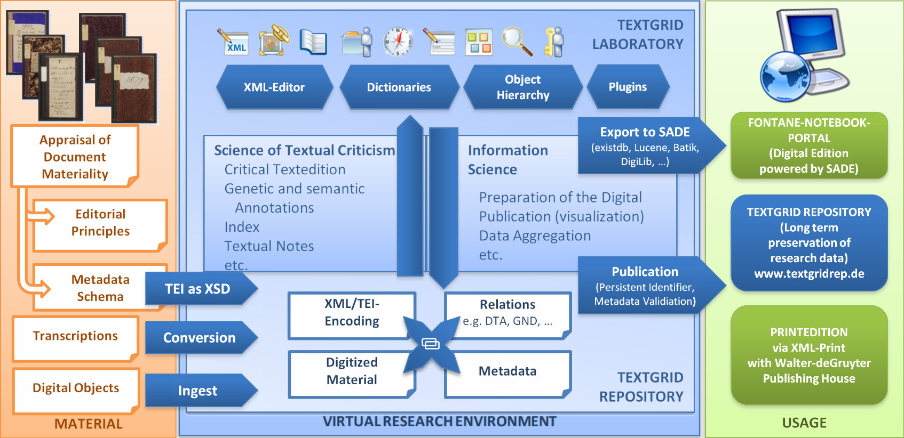
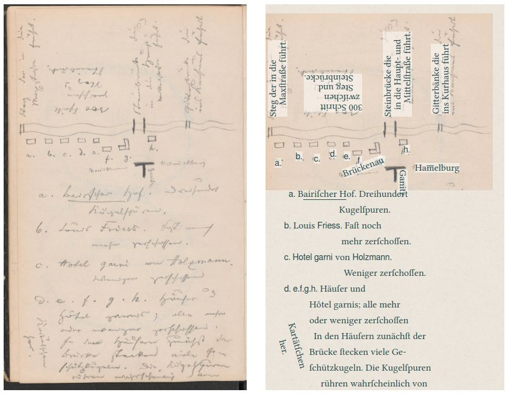
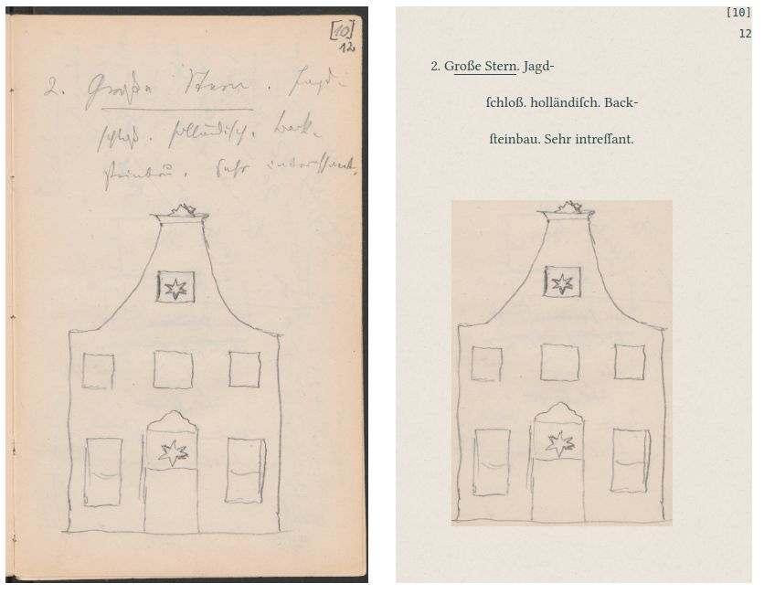
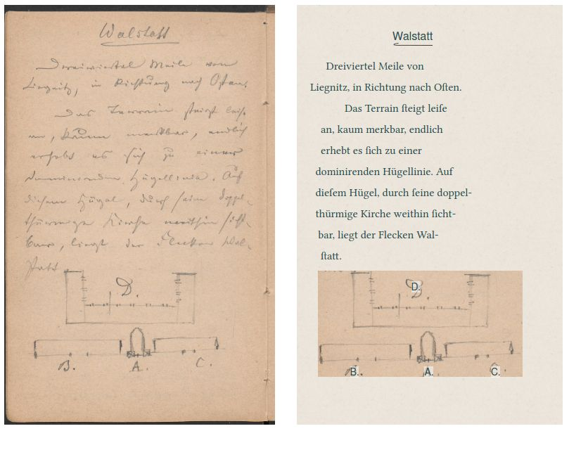
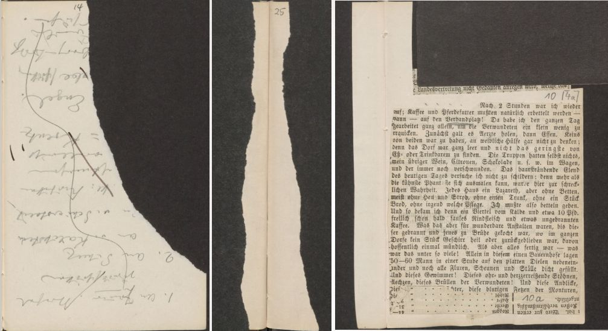
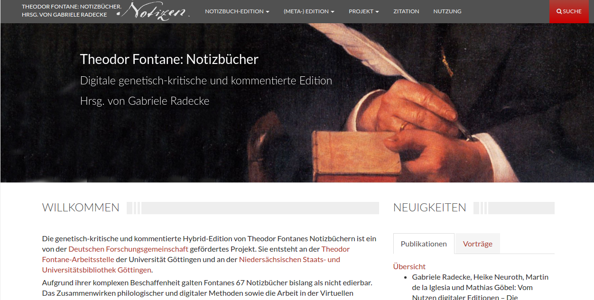
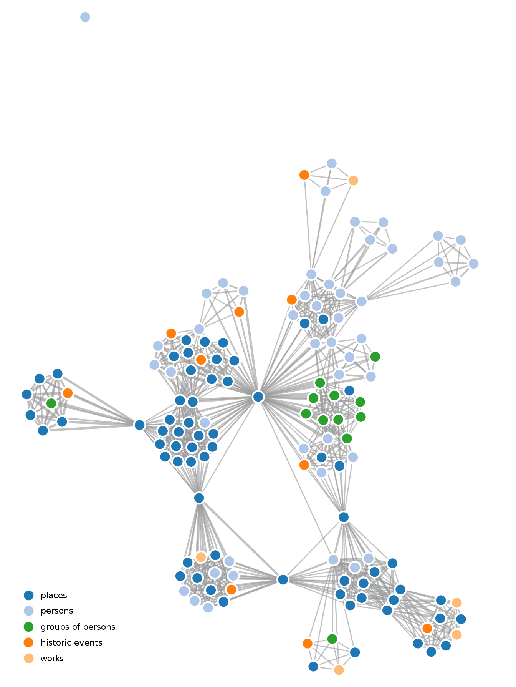

# Welcome
@ARCHITRAVE Kick-Off Meeting, 20170330, Göttingen

--

<i class="fa fa-smile-o fragment" aria-hidden="true"></i>
<i class="fa fa-smile-o fragment" aria-hidden="true"></i>
<i class="fa fa-smile-o fragment" aria-hidden="true"></i>

---

# Theodor Fontane's Notebooks
collaborative work in an interdisciplinary project

--

## Workflow

---

<!-- .slide: data-background="#ffe6cc" -->
## Corpus

- 67 notebooks (unpublished)
- cica 10 000 Pages
- written between 1859 - 1889

--

<!-- .slide: data-background="#ffe6cc" -->
## Content
- travel notes
- diary records
- letter concepts
- roman designs
- poems
- theater and art criticism
- everyday notices

--

<!-- .slide: data-background="#ffe6cc" -->
## Sketches

--

<!-- .slide: data-background="#ffe6cc" -->

--

<!-- .slide: data-background="#ffe6cc" -->

--

<!-- .slide: data-background="#ffe6cc" -->

--

<!-- .slide: data-background="#ffe6cc" -->

---

<!-- .slide: data-background="#cce0ff" -->
## Virtual Research Environment

--

<!-- .slide: data-background="#cce0ff" -->
### Data
- various TEI documents
- metadata
- some information for the processing
- access control within the VRE
- access control lists for files on the public server

--

<!-- .slide: data-background="#cce0ff" -->
### XML Editor

---

<!-- .slide: data-background="#d9f2d9" -->
## Publication Scenarios

--

### SADE

--

### IIIF
[Mirador](https://textgridlab.org/1.0/iiif/manifests/)

--

### Repository
[TextGrid](https://textgridrep.org/search?filter=project.value%3aFontane+Notizb%C3%BCcher+-+Sandbox)

---

# What else?

--

## [Timeline](https://fontane-nb.dariah.eu/tei-conf/simile/)

--

## [Adding Locations to the Temporal Information](http://geobrowser.de.dariah.eu/embed/?kml1=http://fontane-nb.dariah.eu/public/js/vis/geo/c07.kml&currentStatus=mapChanged=Historical+map+of+1880)

--

## 
--

## 
