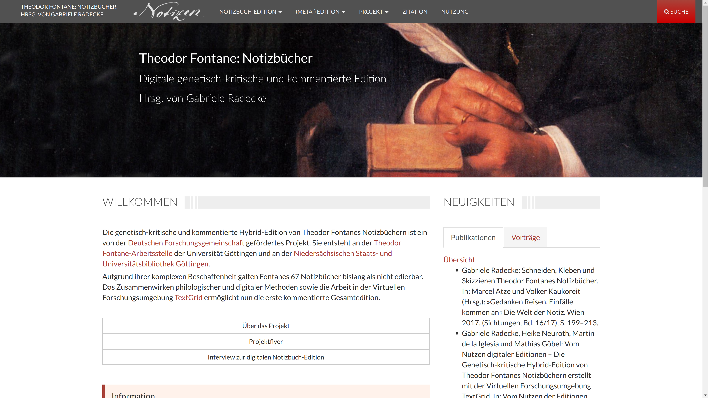

# TextGrid and Fontane

@IIIF Conference, 20170608, Rome

Prof. Dr. Wolfram Horstmann, Ubbo Veentjer, Mathias Göbel

--

offering IIIF in a larger infrastructure for digital editions

--

--

--

<!-- .slide: data-background-video="img/demo_edit1.mp4" data-background-size="contain" -->

--

<video data-autoplay class="stretch" src="img/demo_edit1.mp4"></video>

---

# DARIAH-DE

TextGrid is part of the DARIAH-DE infrastructure that provides authentication
and further services supporting the digital humanities.

[https://de.dariah.eu/](https://de.dariah.eu/)
