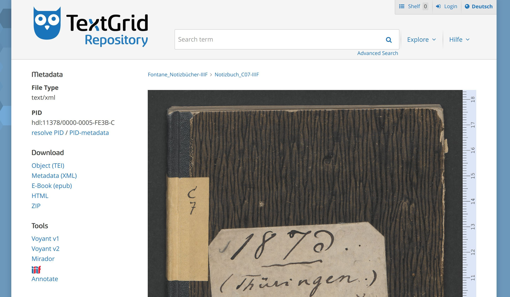

# TextGrid and Fontane

@IIIF Conference, 20170608, Vatican

Wolfram Horstmann, Ubbo Veentjer, Mathias Göbel

--

offering IIIF in an larger infrastructure for digital editions: http://textgrid.de

---

typical code snippet, [C7 1r](https://fontane-nb.dariah.eu/edition.html?id=%2Fxml%2Fdata%2F16b00.xml&page=1r)

--

<!-- .slide: data-background-video="img/demo2_edit1.mp4" data-background-size="contain" -->

--

### Repository: textgridrep.org
- several editions published [314957 objects](https://textgridrep.org/search?query=*)
- [426 IIIF manifests](https://textgridlab.org/1.0/iiif/manifests/)
- made for you!

--

### Laboratory
- client software for preparing xml (TEI) documents

--

##  <!-- .element: style="height: 80px;margin-bottom: -16px;" --> manifest preparation
- conversion from METS/MODS
- or from TEI to IIIF
  - image sequence from @tei:facs
  - further metadata from TextGrid metadata objects

= IIIF for every project

--

## annotation layer (PoC)
- annotations are stored standoff
- web application provides the annotation layer

--

<!-- .slide: data-background-video="img/demo_edit1.mp4" data-background-size="contain" -->

--

[synoptic view](https://fontane-nb.dariah.eu/edition.html?id=/xml/data/16b00.xml&page=1r) of facsimile, transcription and xml code within the Fontane web application

---

## benefits
- projects dont have to setup and maintain there own image server
- even Mirador is served by TextGrid
  - integrated via iframe: see [here](https://fontane-nb.dariah.eu/mirador.html?n=C7)

---

TextGrid is part of the DARIAH-DE infrastructure that provides authentication
and further services supporting the digital humanities.

[https://de.dariah.eu/](https://de.dariah.eu/)
