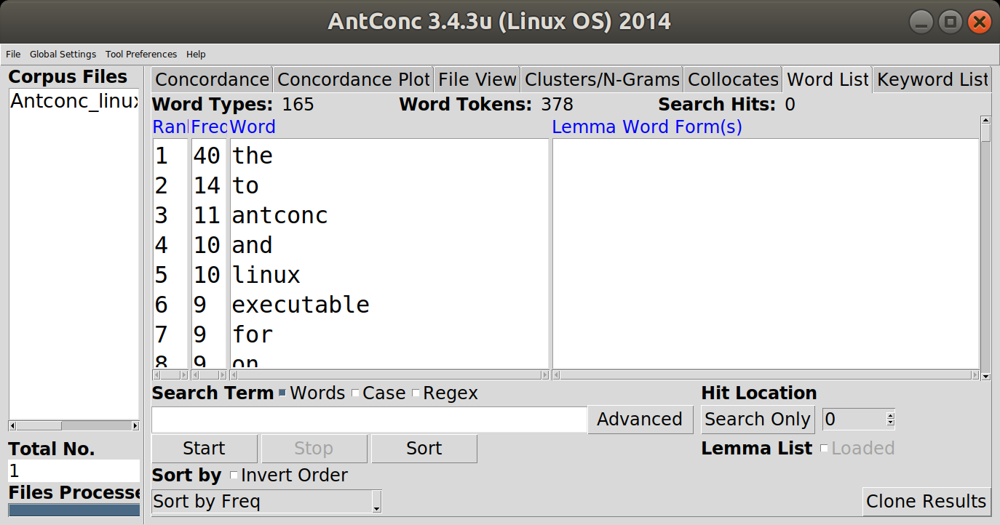

<!-- .slide: data-background-image="img/the_internet_map_2015-extract.png" id="main" -->
# Text und Data Mining

in der Reihe „Digital Humanities im Fokus“

Slides: <https://mathias-goebel.github.io/2018-05-Datenanalyse/>

<small>@goebel_m, SUB Göttingen</small>

<small>CeDiS, 20180530, Berlin</small>

--

## Agenda
- Begutachtung
- Verarbeitung

---

## Datenanalyse

> Data analysis is a process of inspecting, cleansing, transforming, and modeling data with the goal of discovering useful information, suggesting conclusions, and supporting decision-making.

<small>[Wikipedia: Data analysis](https://en.wikipedia.org/wiki/Data_analysis)</small>

---

## Begutachtung

[Gustav Freytag: Die Ahnen](https://textgridrep.org/browse/-/browse/n2kn_0).

--

### Metadaten sammeln

- Quelle
- GND

--

### Metadaten erheben

--

#### Language Detection

```r
install.packages("koRpus")
library(koRpus)
temp <- tempfile()
download.file("https://textgridlab.org/1.0/aggregator/zip/textgrid:n2kn.0?transform=text", temp)
unzip <- unzip(temp)
guess.lang(unzip[2], "/home/mathias/Documents/UDHR")
```

--

### Voyant
Schauen wir uns die Basics einmal an:
[Voyant V2](https://textgridlab.org/voyant2/?corpus=bb1539e58c3945a9f055d227a77e68ab&stopList=stop.de.german.txt)

--

#### Type-Token-Ratio (TTR)
«This corpus has 1 document with 51,138 total words and 5,792 unique word forms.»

--

#### Stoppwörter
Funktionswörter: »unwichtige« Wörter

[Listen via Wikipedia](https://de.wikipedia.org/wiki/Stoppwort)

--

#### N-Grams
Untersucht man in unmittelbarer Nähe zusammenstehende Zeichen/Wörter, bezeichnet man diese als N-Grams.

Bi-Grams, Tri-Grams, 4-Grams,N-Grams

--

### AntConc


---

## Verarbeitung
### Word2Vector <!-- .element class="fragment" -->

--

Wörter bekommen durch den Kontext ihre Bedeutung. Je umfassender das Korpus wird, umso genauer beschreiben die linken und rechten Nachbarn einen Begriff.

--

[Tutorial mit Online-Demo](https://rare-technologies.com/word2vec-tutorial/)

--

[Implementierung auf Basis von DigiZeitschriften](http://127.0.0.1:8889/most_dissimilar?words[]=Bibliothek+Museum+Hamster)

---

## Software

R Core Team (2018). R: A language and environment for statistical computing. R Foundation for Statistical Computing, Vienna, Austria. URL [https://www.R-project.org/](https://www.R-project.org/).

Sinclair, Stéfan and Geoffrey Rockwell (2018). Voyant Tools. URL [http://voyant-tools.org/](http://voyant-tools.org/).
<!--
[(mit unseren Texten)](http://voyant-tools.org/?corpus=87b87dcd2498cba83d5ed2d72e28bc9c)
-->

Anthony, Laurence (2014). AntConc (3.4.3u). Tokyo, Japan: Waseda University. URL [http://www.laurenceanthony.net/](http://www.laurenceanthony.net/)

[gensim](https://radimrehurek.com/gensim/)
