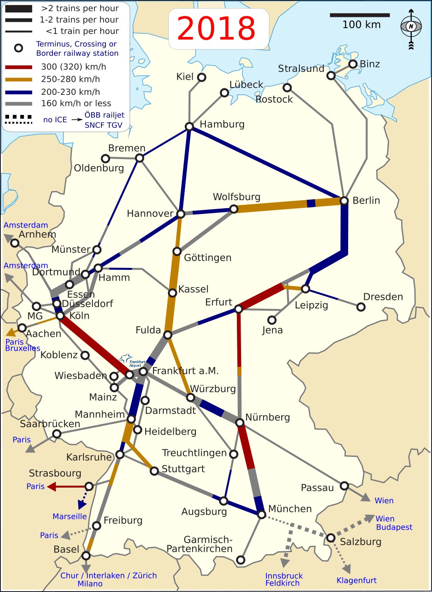
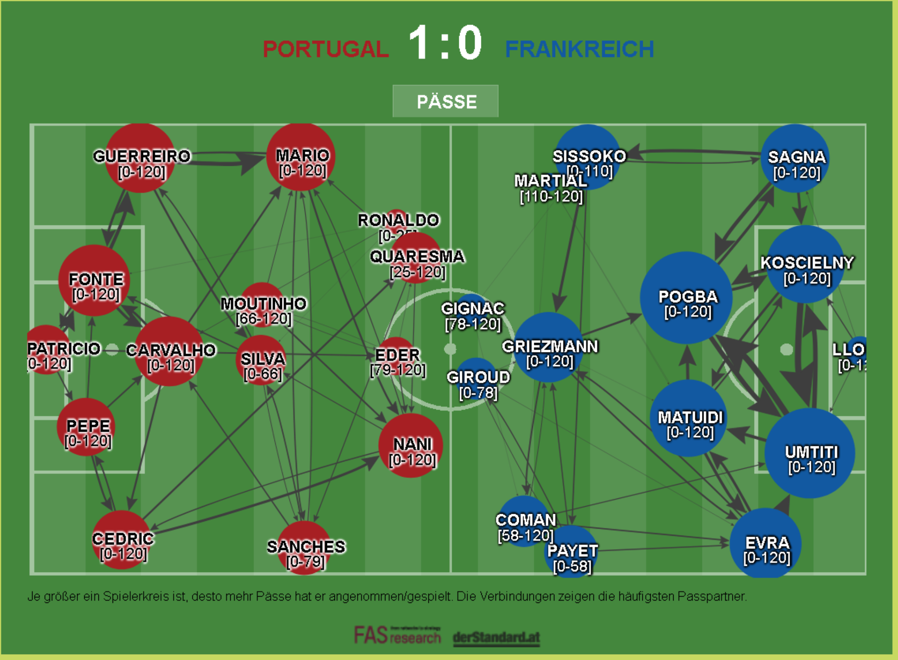
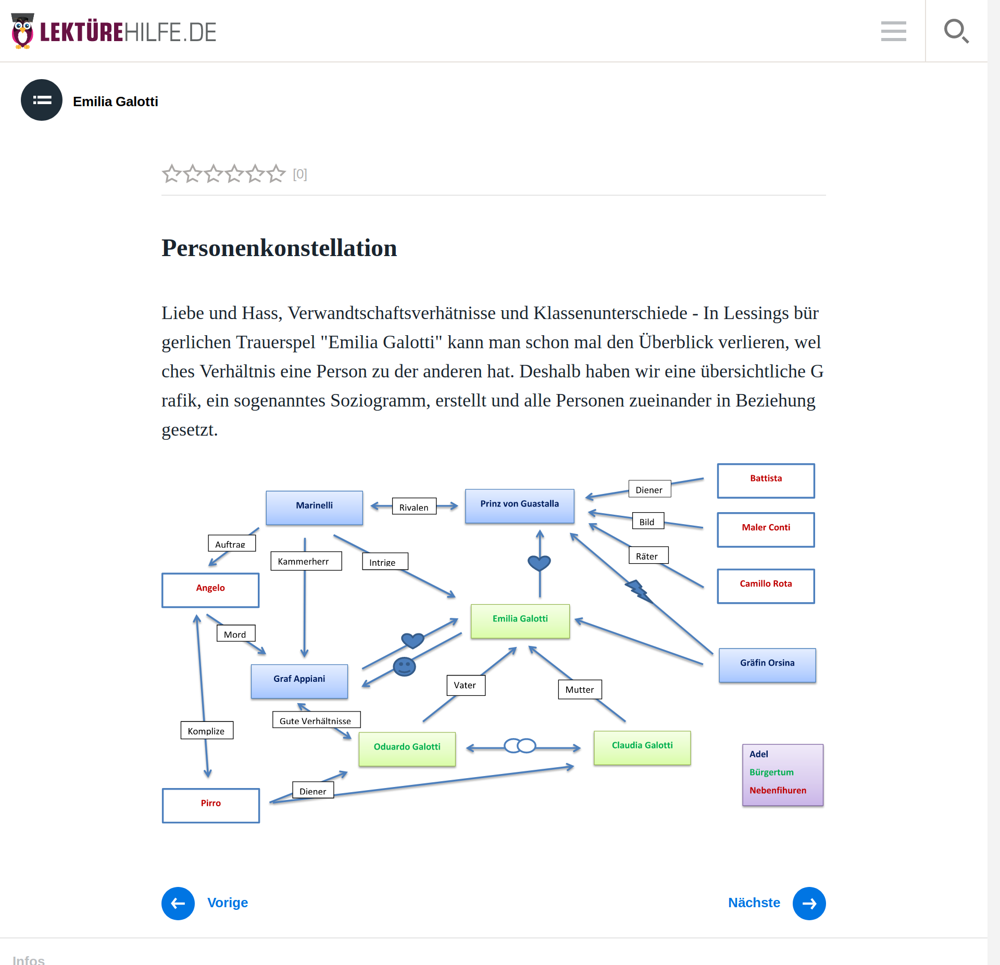
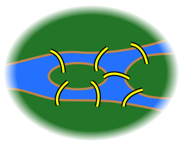
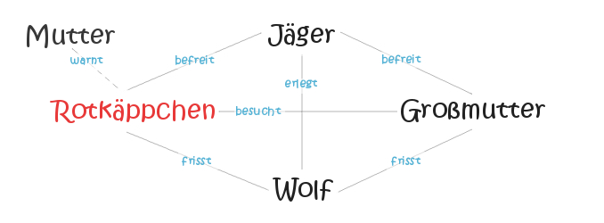
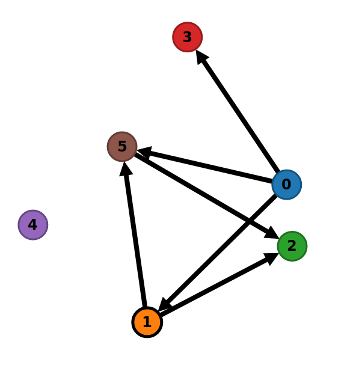
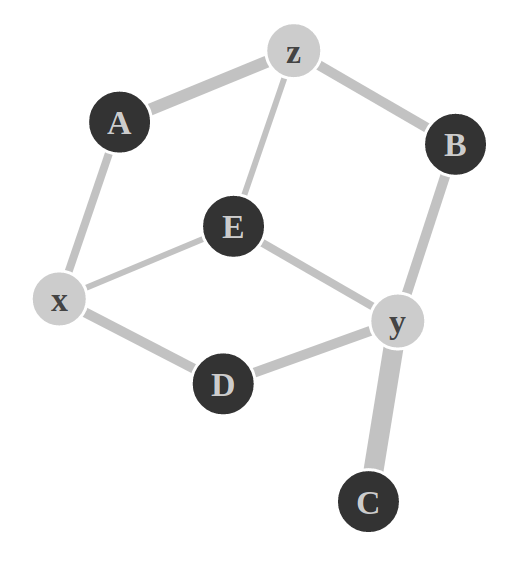
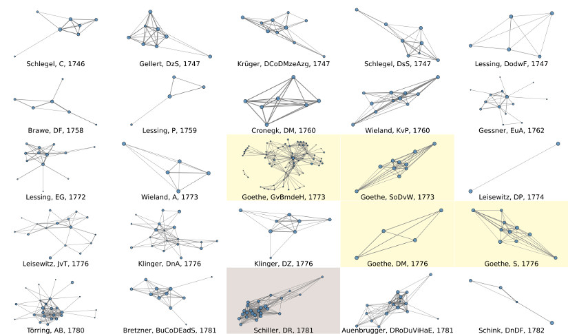

<!-- .slide: data-background-image="img/the_internet_map_2015-extract.png" id="main" -->
# Netzwerkanalyse Literarischer Texte

in der Reihe „Digital Humanities im Fokus“

Slides: <https://mathias-goebel.github.io/2018-05-Netzwerkanalyse/>

<small>@goebel_m, SUB Göttingen (mit Material von Frank Fischer, Peer Trilcke, Danil Skorinkin)</small>

<small>CeDiS, 20180530, Berlin</small>

--

<!-- .slide: data-background-image="img/the_internet_map_2015-extract.png" -->

--

<small>
The Opte Project <a href="https://creativecommons.org/licenses/by/2.5">CC BY 2.5</a> Wikimedia Commons, <a href="https://commons.wikimedia.org/wiki/File:Internet_map_1024.jpg">Link</a></small>

--

 <!-- .element style="object-fit: cover;width: 100%;height: 350px;" -->

<small>Quelle: [DARIAH-DE Statusmeldungen](https://dariah-de.github.io/status/documentation.html)</small>

--

<small><a href="//commons.wikimedia.org/wiki/User:Classical_geographer" title="User:Classical geographer">Classical geographer</a> - Eigenes Werk, <a href="https://creativecommons.org/licenses/by-sa/3.0" title="Creative Commons Attribution-Share Alike 3.0">CC BY-SA 3.0</a>, <a  href="https://commons.wikimedia.org/w/index.php?curid=7349561">Link</a></small>

--

<small>FAS Research und DerStandard, [Link](https://derstandard.at/r2000038530831/Euro-2016-Netzwerkanalysen)</small>

--

<small>Public Domain, <a href="https://commons.wikimedia.org/w/index.php?curid=1353062">Link</a></small>

--

<small>Figurenkonstallation zu Lessings „Emilia Galotti“, [lektuerehilfe.de](https://lektuerehilfe.de/gotthold-ephraim-lessing/emilia-galotti/personenkonstellation)</small>

--

## Agenda

- Operationalisierung
- Digitalisierung
- Visualisierung

---

## Operationalisierung

--

<small>Prinzipdarstellung eines Netzes. [CC-BY-SA 3](https://creativecommons.org/licenses/by-sa/3.0/deed.en). Wikimedia Commons: [Netz.svg](https://commons.wikimedia.org/wiki/File:Netz.svg)</small>

--

<small>Wikimedia Commons: [Konigsberg_bridges.png](https://commons.wikimedia.org/wiki/File:Konigsberg_bridges.png)</small>

--

<small>Wikimedia Commons: [File:7_bridges.svg](https://commons.wikimedia.org/wiki/File:7_bridges.svg)</small>

--

<small>Wikimedia Commons: [File:Königsberg_graph.svg](https://commons.wikimedia.org/wiki/File:Königsberg_graph.svg)</small>

--

### Abstraktion

- Länge der Kanten
- Position der Knoten

--

### Gerichtete Graphen <!-- .element class="fragment" -->

<small>Quelle: https://wortwuchs.net/figurenkonstellation/</small>

--

--

### Gewichtete Kanten <!-- .element class="fragment" -->

---

## Digitalisierung

Digitale Bestände wachsen stetig.

--

Welche Nutzung erfahren die digitalen Ressourcen?

- Langzeitarchivierung
  - DTA
  - TextGrid Repository
- Präsentation
  - Wikisource
  - Gutenberg
- Aggregationen
  - DDB
- … ???

--

<!-- .slide: data-background-image="img/distant-reading-showcase-poster.jpg" -->

 <!-- .element class="fragment" -->

---

## Visualisierung

[DLINA](https://dlina.github.io)

[EzLinaVis](https://ezlinavis.dracor.org/)

[DraCor](https://dracor.org/)
