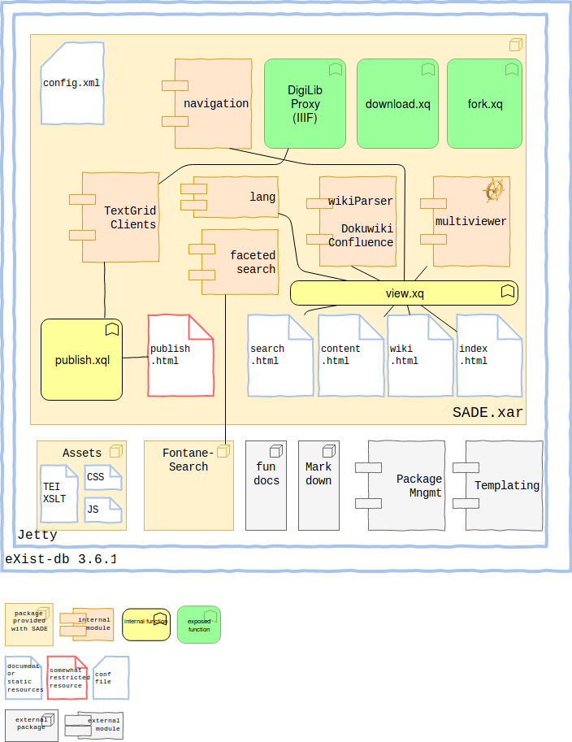

# SADE <!-- .element class="fragment" data-fragment-index="1" style="height: 0.3em;vertical-align: top;"-->
<small class="fragment" data-fragment-index="1"> A TextGrid flavoured version of the </small><br/>
Scalable Architecture for Digital Editions

in der Reihe „Digital Humanities im Fokus“

Slides: <https://mathias-goebel.github.io/2018-05-SADE3/>

<small>@goebel_m, SUB Göttingen</small>

<small>CeDiS, 20180530, Berlin</small>

---

## Idee

--

### Joint Venture
- BBAW
  - Czmiel, Alexander: Editio ex machina - Digital Scholarly Editions out of the Box [🔗](http://www.ekl.oulu.fi/dh2008/Digital%20Humanities%202008%20Book%20of%20Abstracts.pdf)
- ÖAW
- SUB <!-- .element class="fragment highlight-blue" -->

--

### Publikation
- Visualisierung
- Suchfunktionen
- Bereitstellung (API)
- Grundlage: Langzeitarchiv

--

### Transformation
- Konversion
- Adaptierbarkeit
- Linked Open Data

--

### Analyse
- Häufigkeiten
- Verknüpfungen

--

### Ziel

ein Programmpaket

viele Entwicklungen

(ein Wartungsworkflow für alle Instanzen)

---

<!-- .slide: data-background="#000000" -->
## Devops


--

### Source Code
[https://gitlab.gwdg.de/SADE](https://gitlab.gwdg.de/SADE)

--

### Architektur


---

## Projekte

- Fontane Notizbücher [🔗](https://fontane-nb.dariah.eu/index.html)
- Bibliothek der Neologie [🔗](https://bdn-edition.de/)
- ARCHITRAVE [🔗 SUB](https://www.sub.uni-goettingen.de/projekte-forschung/projektdetails/projekt/architrave/)
  - <small>Kunst und Architektur in Paris und Versailles im Spiegel deutscher Reiseberichte des Barock</small>
- Hannah Arendt. Kritische Gesamtausgabe [🔗 SUB](https://www.sub.uni-goettingen.de/projekte-forschung/projektdetails/projekt/hannah-arendt-kritische-gesamtausgabe/)
- Dialogo Medieval

---

## [Features](https://gitlab.gwdg.de/SADE/SADE/blob/develop/docs/about.md) I (Suche)
- Facettensuche
- fork/download SADE
- Vorkonfigurierter Index
- Lucene String Analyzer

--

## [Features](https://gitlab.gwdg.de/SADE/SADE/blob/develop/docs/about.md) II (Webseite)
- Frontend
  - Top-Menu
  - professionelles Template
- Wikiparser
  - Synchronisierung von Wikiseiten
  - Confluence
  - Dokuwiki
- Mehrsprachigkeit

--

## [Features](https://gitlab.gwdg.de/SADE/SADE/blob/develop/docs/about.md) III (Daten)
- TEI-XSLT-Stylesheets
- Prerendering
- TextGrid Clients
  - Datentransfer aus dem TextGrid Repository
  - XML-Validation bei Publikation
  - WRITE to TextGrid Repository
  - auch IIIF (Mirador) <!-- .element style="color:lightgrey" -->

---

### Suche
[query=Würzburg](https://fontane-nb.dariah.eu/test/results.html?q=W%C3%BCrzburg)

--

### Facettensuche
[query=Luther](https://fontane-nb.dariah.eu/test/results.html?q=Luther)
[facet=plc:Wartburg](https://fontane-nb.dariah.eu/test/results.html?q=Luther&facet=plc:plc%3AWartburg,&order=&order-by=)

--

#### [Konfiguration](https://gitlab.gwdg.de/SADE/SADE/blob/develop/docs/faceted-search.md)
```xml
<param key="facets">
    <facet key="authors" title="Authors">
        <xpath>tei:author</xpath>
    </facet>
    <facet key="keywords" title="Schlagwort">
        <xpath>tei:term</xpath>
    </facet>
    <facet key="dates" title="Zeit">
        <xpath>tei:date/@when</xpath>
    </facet>
</param>
```

---

## Publikationsprozess

[DEMO]
Dokumente aus dem TextGridLab übertragen.

--

### Download


--

### Entpacken

--

### Starten

[webinterface](http://localhost:8080/exist/apps/sade/index.html)

--

### Zugangsdaten
User: admin

--

“We are happy to get your bug reports and feature requests!”
