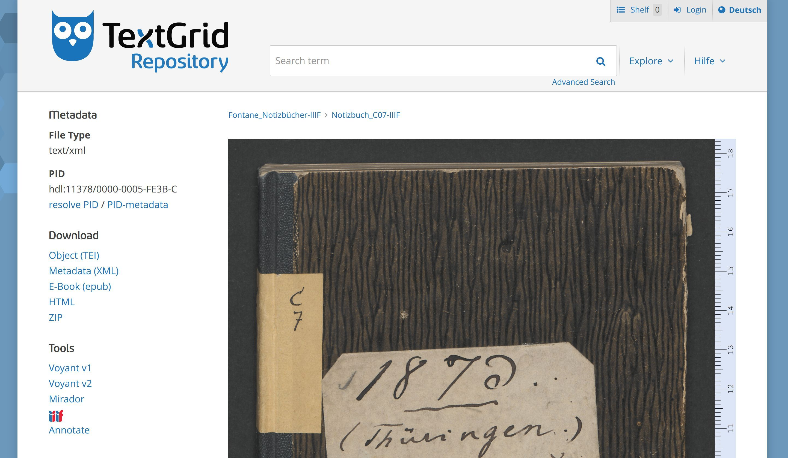
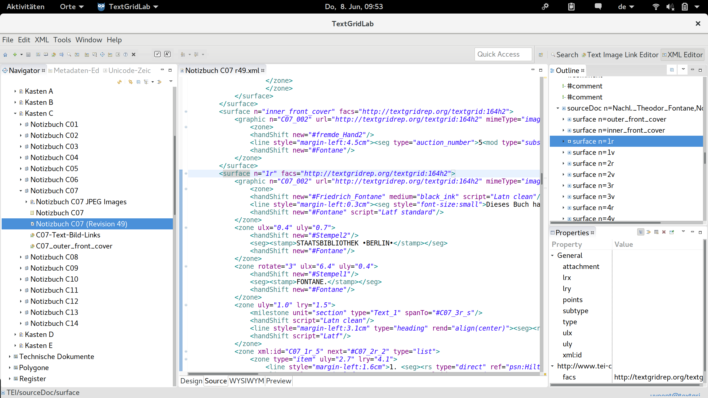
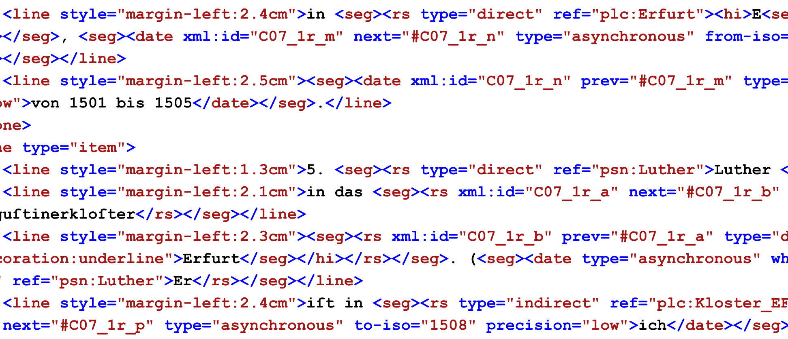
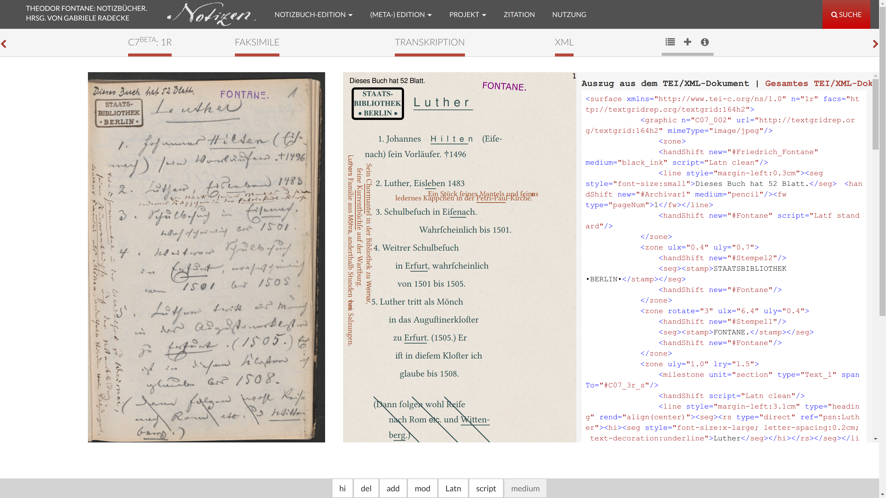

# Advanced IIIF usage
Mathias Göbel

<small>Goettingen State and University Library</small>

---

the DARIAH-DE infrastructure provides services supporting the digital
humanities.

[https://de.dariah.eu/](https://de.dariah.eu/)

--

offering IIIF in an larger infrastructure for digital editions: http://textgrid.de

--

### Repository: textgridrep.org
- several editions published [314957 objects](https://textgridrep.org/search?query=*)
- [426 (and increasing) IIIF manifests](https://textgridlab.org/1.0/iiif/manifests/)
- made for a world-wide community

 <!-- .element: style="height:375px;" -->

--

##  <!-- .element: style="height: 80px;margin-bottom: -16px;" -->
manifest preparation:
- conversion from METS/MODS or TEI
  - image sequence from @tei:facs
  - further metadata from TextGrid metadata objects, editable via the Lab

\+ central image server (DigiLib)

= IIIF for every project

--

## benefits
- projects do not have to setup and maintain their own image server
- even Mirador is served by TextGrid
  - integrated via iframe: see [here](https://fontane-nb.dariah.eu/mirador.html?n=C7)

--

### Laboratory
- client software for preparing xml (TEI) documents

---

## Theodor Fontane: Notebooks

--

- 11.000 pages
- highly diverse handwritten material
  - sketches
  - lists
  - timetables
  - manuscripts
  - travel reports
  - …

--

typical code snippet, [C7 1r](https://fontane-nb.dariah.eu/edition.html?id=%2Fxml%2Fdata%2F16b00.xml&page=1r)

--

<!-- .slide: data-background-video="img/demo2_edit1.mp4" data-background-size="contain" -->

--

## annotation layer (PoC)
- annotations are stored standoff
- web application provides the annotation layer
- [live demonstration](http://dev.textgridlab.org/1.0/iiif/mirador/fontano.html?json=479108)

--

<!-- .slide: data-background-video="img/demo_edit1.mp4" data-background-size="contain" -->

--

[synoptic view](https://fontane-nb.dariah.eu/edition.html?id=/xml/data/16b00.xml&page=1r) of facsimile, transcription and xml code within the Fontane web application

---

## Manifests on the fly
preview unpublished material via IIIF

--

- no overhead
- easy to set up
- just need a single additional application

--

[DEMO: Laboratory, Import, Aggregation, Order]
