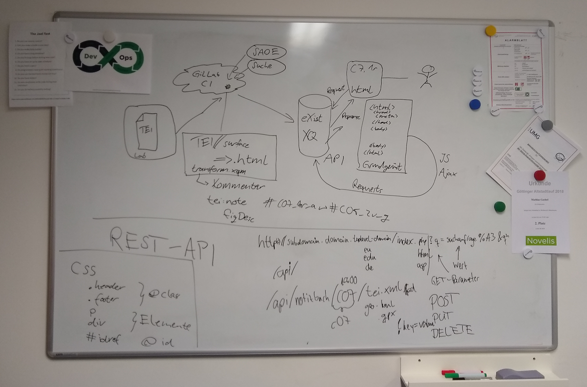

# XML-Schulung Teil II: Transformationen und Abfragen

mit XSLT und XQuery zu PDF und anderen Visualisierungen

<small>Mathias Göbel, SUB Göttingen, 12.02.2019 @ GCDH</small>

--

+ Transformationen (in Oxygen, XSLT)
+ Abfragen (in Oxygen, XQuery)
+ Abfragen einer XML-Datenbank (eXist-db, XQuery)
---
+ TEI
+ XPath
+ XML

--

## Anwendungsfälle

+ PDFs erzeugen
  + Publikation
  + Überprüfung
  + Kollationierung

+ Informationen…
  * …ex­tra­hie­ren
  * …aggregieren
  * …filtern
  * …manipulieren

--

und:

+ Anwendungen bauen
+ Suchfunktionen etablieren
+ APIs bauen

--


--


---

## XPath
Gestern haben wir XML-Dokumente erstellt.

Die sind streng hierarchisch organisiert: von der (einen) Wurzel bis zu den Blättern

--

<!-- .slide: data-background-image="img/Kucuk_Camlica_06465-Wikicommons-Nevit_Dilmen-CC-BY-SA3.jpg" data-background-size="contain" -->
<small style="margin-top: 67%;color:white;">“Tree at Küçük Çamlıca, Istanbul”. Nevit Dilmen from Wikimedia Commons. [CC BY-SA 3.0](http://creativecommons.org/licenses/by-sa/3.0/)</small>

--

 <!-- .element: height="555" -->

<small>Quelle: Crane Softwrights. 2001. In: Kredel, Heinz. Internet-Technologien. 2005. Rechenzentrum Universität Mannheim. [online](http://krum.rz.uni-mannheim.de/inet-2005/sess-302.html).</small>

--

### XPath Achsen
```xml
/TEI/teiHeader/fileStmt/titleStmt/title
```

--

#### Oxygen
`mein_tagebuch.xml` öffnen

 <!-- .element: height="555" -->

--

#### Übung
Bitte suchen Sie sich eine beliebige (aber schöne) Stelle im XML-Dokument aus.
Kopieren Sie bitte den `XPath` und fügen Sie diesen bitte einfach ein unter:

http://tiny.cc/xml19 <!-- .element: style="font-size:2em;" -->

--

#### Übung

 <!-- .element: height="555" -->

--

#### Übung
 <!-- .element: height="555" -->

--

### XPath Achsen
* `/@attribtue`
* `/text()`
* `/comment()`

* `/node()` (Elemente, Attribute, Text)

--

### XPath Funktionen
```xquery
starts-with(., "")],
contains(., "Bayern")],
tokenize("This is a sentence.", " "),
count(//div)
```

[108 Funktionen](https://www.w3schools.com/xml/xsl_functions.asp) <!-- .element: class="fragment" -->

--

### XPath Operatoren
| Operator | Description | Example |
|-----|-----|-----|
| I (pipe) | Computes two node-sets | `//tei:rs I //tei:name` |
| + | Addition | `6 + 4` |
| - | Subtraction | `6 - 4` |
| * | Multiplication | `6 * 4` |
| div | Division | `8 div 4` |
| = | Equal | `price=9.80` |

Quelle: [w3schools.com](https://www.w3schools.com/xml/xpath_operators.asp)


--

| | | |
|-|-|-|
| != | Not equal | `price!=9.80` |
| < | Less than | `price<9.80` |
| <= | Less than or equal to | `price<=9.80` |
| > | Greater than | `price>9.80` |
| >= | Greater than or equal to | `price>=9.80` |
| or | or | `price=9.80 or price=9.70` |
| and | and  | `price>9.00 and price<9.90` |
| mod | Modulus (division remainder) | `5 mod 2` |

Quelle: [w3schools.com](https://www.w3schools.com/xml/xpath_operators.asp)

--

#### Übung


---

## Transformationen
Die TEI unterbreitet <span class="fragment highlight-red">Vorschläge</span> zur
Visualisierung der XML-Dokumente: [die TEI-Stylesheets](https://github.com/TEIC/Stylesheets)

Sie finden auch Verwendung bei Oxgarage. <!-- .element: class="fragment" -->

--

### Zielformate
Mit XSLT oder XQuery können wir XML-Dokumente in beliebige andere Formate
umwandeln. Dabei können wir auch nach belieben filtern. Die Ausgaben sind in
vielen Fällen gut anpassbar.

--

### Oxygen
+ in der Symbolleiste: 

--

### Oxygen
 <!-- .element: height="555" -->

--

### Apply

--

### Parameter ändern: Schritt 1
 <!-- .element: height="555" -->

--

### Parameter ändern: Schritt 2


--

### Parameter ändern: Schritt 3


--

### Übung
Schalten Sie bitte diese lästige Nummerierung der Überschriften aus.

--

### Übung
Wenden Sie bitte das Transformationsszenario «TEI P5 - XHTML» an und berichten
Sie, was passiert.

--

<!-- .slide: style="color:lightgray;" -->
### Processing Instruction <!-- .element: style="color:lightgray;" -->
Ist dies in Oxygen konfiguriert gibt es praktisch keinen Mehrwert für Externe.
Die Konfiguration an sich ist nicht nachhaltig gespeichert. Daher können wir
diese auch in das XML-Dokument schreiben. Dazu dienen *processing instructions*.
```xml
<?xml-stylesheet type="text/xsl" href="path/to/xslt.xsl"?>
```

---

## XQuery

* Programmiersprache
  * Turing-vollständig
  * funktional
  * deklarativ
  * modular
  * interpretierbar

--

> XQuery 1.0 became a W3C Recommendation on January 23, 2007.
>
> XQuery 3.0 became a W3C Recommendation on April 8, 2014.
>
> XQuery 3.1 became a W3C Recommendation on March 21, 2017.

Quelle: https://en.wikipedia.org/w/index.php?title=XQuery&oldid=843799532

--

### Rechnen

```xq
1+1
```
---

```xq
2
```
<!-- .element: class="fragment" -->

--

### Schreiben

```xq
"Hallo Welt."
```
---

```
Hallo Welt.
```
<!-- .element: class="fragment" -->

--

```xq
"eins plus eins ist gleich " || 1+1
```
---
```xq
"eins plus eins ist gleich 2"
```

--

### Lesen
```xq
//*:TEI//*:title
```
---
```
<title>Ausschnitt aus dem Tagebuch von Samuel Thomas Soemmerring (1755-1830)</title>
<title>Tagebücher von Samuel Thomas von Soemmerring</title>
```
<!-- .element: class="fragment" -->

--

### Really?
no.

Tatsächlich war keines dieser Beispiele XQuery. <!-- .element: class="fragment" -->

--

  <!-- .element: height="555" style="filter: brightness(130%) saturate(75%);" -->

Quelle: Institut Obert de Catalunya, CC-BY-NC-SA, [URL](http://ioc.xtec.cat/materials/FP/Materials/2251_ASIX/ASIX_2251_M04/web/html/WebContent/u3/a2/continguts.html)

--

### Lesen
```xq
doc("https://de.wikipedia.org")
```
---
```
#document
```
<!-- .element: class="fragment" -->

--

### Zählen
```xq
doc("http://de.wikipedia.org")//* => count()
```
---
```
576
```
<!-- .element: class="fragment" -->

--

### Zählen
```xq
doc("http://de.wikipedia.org")//*/count(.)
```
---
```
1
1
1
1
[… ins. 576 mal]
```
<!-- .element: class="fragment" -->

--

```
//@when
```
---
`ERROR`

--

🌷<!-- .element: class="fragment" -->

🌷<!-- .element: class="fragment" -->

🌷<!-- .element: class="fragment" -->

🌷<!-- .element: class="fragment" -->

🌷<!-- .element: class="fragment" -->

### FLOWR <!-- .element: class="fragment" -->

--

### FLOWR

for

let

order by

where

return

--

```xq
for $word in $paragraph
order by $w
return
$w
```

--

```xq
for $word in $paragraph
let $WORD := upper-case($word)
order by $WORD
return
$w
```

--

```xq
//*:date/@when
```
--

unsere finale Abfrage erstellt eine Wortliste, sortiert nach Häufigkeit und
gibt eine csv-Ausgabe:

--

```xq
declare namespace output="http://www.w3.org/2010/xslt-xquery-serialization";
declare option output:method "text";

let $wordList :=
  tokenize(
    normalize-space(/*:TEI/*:text) , " "
  )

for $word in distinct-values($wordList)
let $wordListSorting := count( index-of($wordList, $word) )
order by $wordListSorting descending
where not(matches($word, "\d|\["))
return
($word || ";" || $wordListSorting || "
")
```

---



---

## Lessons Learned

Wenn Ihnen jemand sagt, sie sollten im Projekt stärker auf XML setzen,
so ist das erstmal generell keine schlechte Idee.

Wenn Sie dann noch eine Person haben, die dies unterstützt, die Workflows
entsprechend gestaltet und auf Basis von XML eine Anwendung entwickelt, so haben
Sie diese Person bitte ganz doll lieb.

Und falls Sie diese Person nicht haben: Wir sind auch für Sie da.

---

## Referenzen

[W3C XQuery Specification](https://www.w3.org/TR/xquery-31/)

[FunctX (incl. XPath functions)](http://www.xqueryfunctions.com/)

--

## Lesenswertes

Kay, Michael. 2006. Learn XQuery in 10 Minutes. DataDirect Technologies, Inc. Online: [stylusstudio.com](http://www.stylusstudio.com/whitepapers/Learn_XQuery_10.pdf)

Walmsley, Priscilla. 2016. XQuery, 2nd Edition.  [Chapter 1 for free](http://www.datypic.com/books/xquery/9781491915103_sampler.pdf)

--

## Probierenswertes

* [w3schools.com XQuery Tutorial](https://www.w3schools.com/xml/xquery_intro.asp)
* oder [tutorialspoint.com/xquery](https://www.tutorialspoint.com/xquery/index.htm)
* oder beide <!-- .element: class="fragment" -->

--

## Beispiele

Wikibooks contributors, "XQuery," Wikibooks, The Free Textbook Project,  [online](https://en.wikibooks.org/w/index.php?title=XQuery&oldid=3514402) (accessed February 11, 2019).
