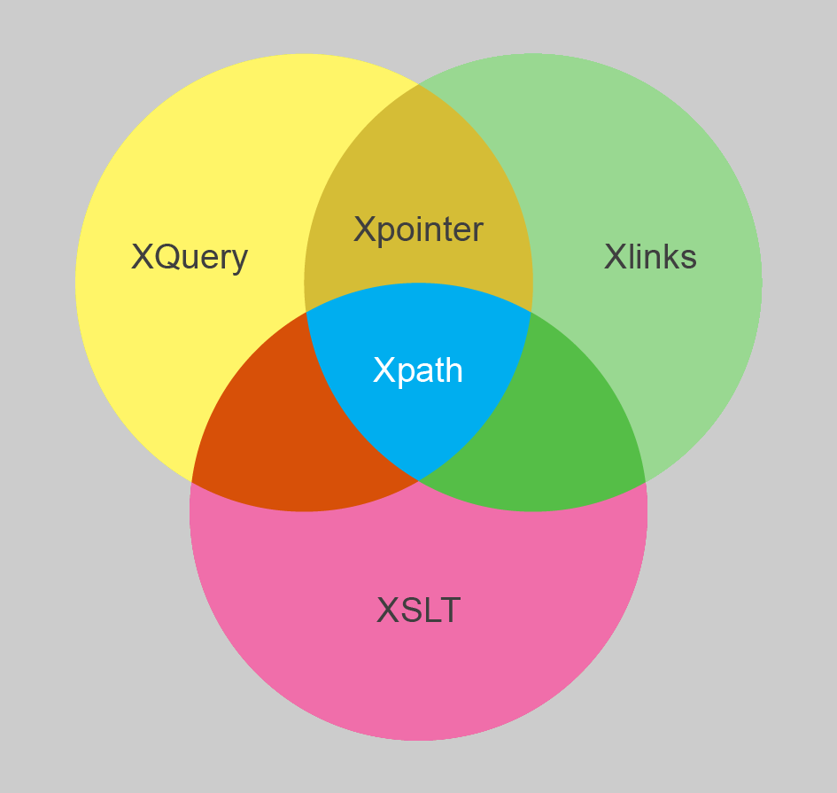

# XML-Schulung Teil II: Transformationen und Abfragen

mit XSLT und XQuery zu PDF und anderen Visualisierungen

<small>Mathias Göbel, SUB Göttingen, 12.02.2019 @ GCDH</small>

--

+ Transformationen (in Oxygen, XSLT)
+ Abfragen (in Oxygen, XQuery)
+ Abfragen einer XML-Datenbank (eXist-db, XQuery)
---
+ TEI
+ XPath
+ XML

--

## Anwendungsfälle

+ PDFs erzeugen
  + Publikation
  + Überprüfung
  + Kollationierung

+ Informationen…
  * …ex­tra­hie­ren
  * …aggregieren
  * …filtern
  * …manipulieren

--

und:

+ Anwendungen bauen
+ Suchfunktionen etablieren
+ APIs bauen

--


--


---

## Transformationen
Die TEI unterbreitet <span class="fragment highlight-red">Vorschläge</span> zur
Visualisierung der XML-Dokumente: [die TEI-Stylesheets](https://github.com/TEIC/Stylesheets)

Sie finden auch Verwendung bei Oxgarage. <!-- .element: class="fragment" -->

--

### Zielformate
Mit XSLT oder XQuery können wir XML-Dokumente in beliebige andere Formate
umwandeln. Dabei können wir auch nach belieben filtern. Die Ausgaben sind in
vielen Fällen gut anpassbar.

--

### Oxygen

+ `mein_tagebuch.xml` öffnen
+ in der Symbolleiste: 

--

### Oxygen
 <!-- .element: height="555" -->

--

### Apply

--

### Parameter ändern: Schritt 1
 <!-- .element: height="555" -->

--

### Parameter ändern: Schritt 2


--

### Parameter ändern: Schritt 3


--

### Übung
Schalten Sie bitte diese lästige Nummerierung der Überschriften aus.

--

### Übung
Wenden Sie bitte das Transformationsszenario «TEI P5 - XHTML» an und berichten
Sie, was passiert.

--

<!-- .slide: style="color:lightgray;" -->
### Processing Instruction <!-- .element: style="color:lightgray;" -->
Ist dies in Oxygen konfiguriert gibt es praktisch keinen Mehrwert für Externe.
Die Konfiguration an sich ist nicht nachhaltig gespeichert. Daher können wir
diese auch in das XML-Dokument schreiben. Dazu dienen *processing instructions*.
```xml
<?xml-stylesheet type="text/xsl" href="path/to/xslt.xsl"?>
```

--

## XQuery

* Programmiersprache
  * Turing-vollständig
  * funktional
  * deklarativ
  * modular

--

> XQuery 1.0 became a W3C Recommendation on January 23, 2007.
>
> XQuery 3.0 became a W3C Recommendation on April 8, 2014.
>
> XQuery 3.1 became a W3C Recommendation on March 21, 2017.

Quelle: https://en.wikipedia.org/w/index.php?title=XQuery&oldid=843799532

--

### Rechnen

```xq
1+1
```
---

```xq
2
```
<!-- .element: class="fragment" -->

--

### Schreiben

```xq
string("Hallo Welt.")
```
---

```
Hallo Welt.
```
<!-- .element: class="fragment" -->

--

### Lesen
```xq
//*:TEI//*:title
```
---
```
<title xmlns="http://www.tei-c.org/ns/1.0">Ausschnitt aus dem Tagebuch von Samuel Thomas Soemmerring (1755-1830)</title>
<title xmlns="http://www.tei-c.org/ns/1.0">Tagebücher von Samuel Thomas von Soemmerring</title>
```
<!-- .element: class="fragment" -->

--

### Really?
no.

--

Tatsächlich war kein einziges dieser Beispiele XQuery.
  <!-- .element: height="555" -->

Quelle: Institut Obert de Catalunya, CC-BY-NC-SA, [URL](http://ioc.xtec.cat/materials/FP/Materials/2251_ASIX/ASIX_2251_M04/web/html/WebContent/u3/a2/continguts.html)

--

### Lesen
```xq
doc("https://de.wikipedia.org")
```
---
```
#document
```
<!-- .element: class="fragment" -->

--

### XQuery

```xq
doc("http://de.wikipedia.org")//* => count()
```
---
```
576
```
<!-- .element: class="fragment" -->

--

```xq
doc("http://de.wikipedia.org")//* ! count(.)
```
---
```
1
1
1
1
[…]
```
<!-- .element: class="fragment" -->

--

### FLOWR
```xq
for $w in $list-of-words
order by $w
return
$w
```

--


--

## Referenzen

[W3C XQuery Specification](https://www.w3.org/TR/xquery-31/)

[FunctX (incl. XPath functions)](http://www.xqueryfunctions.com/)

--

## Lesenswertes

Walmsley, Priscilla. 2016. XQuery, 2nd Edition. [Chapter 1 for free](http://www.datypic.com/books/xquery/9781491915103_sampler.pdf)

--

## Probierenswertes

[w3schools.com XQuery Tutorial](https://www.w3schools.com/xml/xquery_intro.asp)
