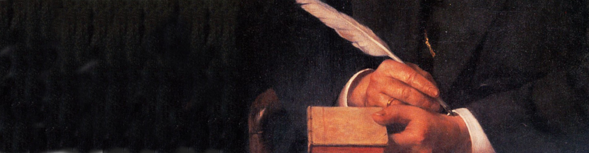
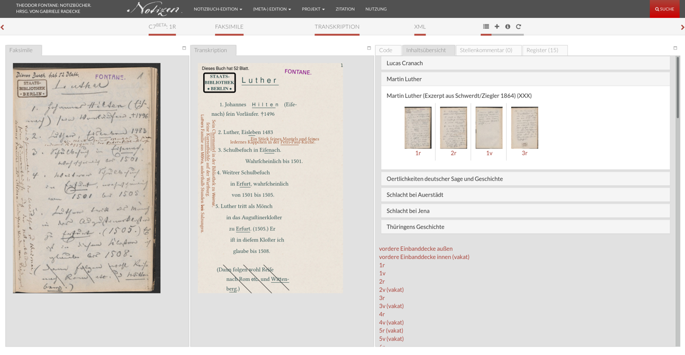
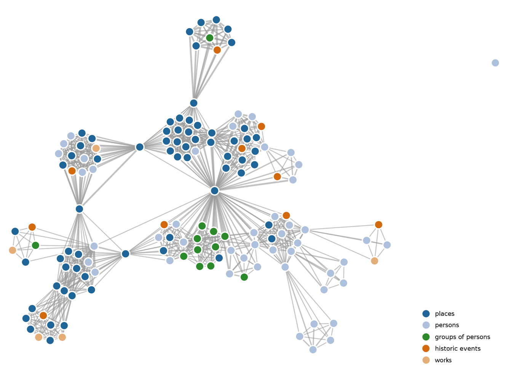
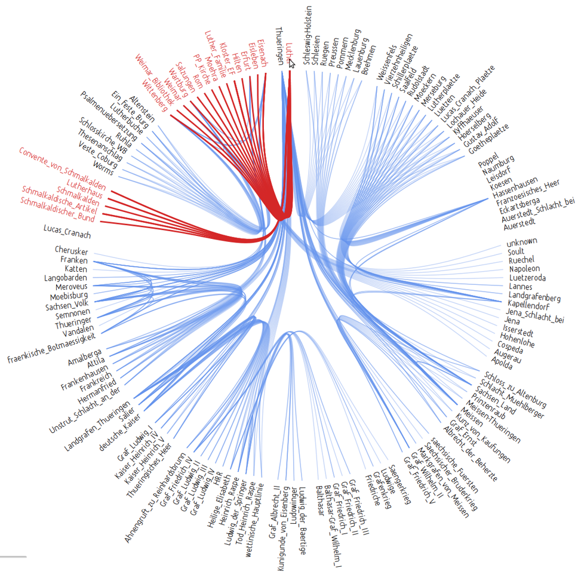

# Fontane.200/Autor

\[Vortrag Teil 1: Gabriele Radecke\]

Teil 2: Mathias Göbel (diese Slides)

<small>Universität Göttingen | DFG-gefördertes Projekt: Theodor Fontanes Notizbücher</small>

--


--

## SUB: Forschung und Entwicklung
Digitale Infrastrukturen für alle Disziplinen
+ Datenmanagement
+ Langzeitarchivierung
+ Basisdienste (Speicher, Server, Authentifizierung)
+ Digitale Workflows

Wissenschaftliche Software
+ Datenerfassung
+ Verarbeitung
+ Präsentation

--

## Workflow


--


[https://fontane-nb.dariah.eu](https://fontane-nb.dariah.eu)

--

## Fontane interconnected
+ Übersicht zu einem Notizbuch
+ https://fontane-nb.dariah.eu/kaesten.html?n=a1
+ Registereinträge zu diesem Buch (Personenregister)
+ https://fontane-nb.dariah.eu/register-listPerson.html?nb=1zzdk#Fontane_Theodor
+ Verknüpfung zu GND, ADB und Wikipedia


--

Vom Register zur Notizbuchseite:
+ https://fontane-nb.dariah.eu/edition.html?id=%2Fxml%2Fdata%2F1zzdk.xml&page=26r&target=Fontane_Theodor
+ Hervorhebung der Zielstelle

```xml
<rs type="direct" ref="psn:Fontane_Theodor">Ich</rs>
```

--

### Autocompletion


--

Zu Notizbuch A1
+ https://fontane-nb.dariah.eu/ueberblickskommentar.html?id=/xml/data/1zzdk.xml
+ Zu „Fontanes Quellen“ zu Notizbuch A1
+ https://fontane-nb.dariah.eu/ueberblickskommentar.html?id=/xml/data/1zzdk.xml#r11
+ Von dort aus
  + zum Literaturverzeichnis
  + Zur Notizbuchseite

--
## Synoptische Ansicht


--

## Zitierfähigkeit
+ Zitationsempfehlung zu jeder Seite
+ Digitale Objekte (nicht nur Webseiten, sondern Daten) zitieren
+ Persistent Identifier (PID)
+ Zitation der langzeitarchivierten Objekte aus dem TextGrid Repository

--

## Nachnutzbarkeit
+ SADE: Skalierbare Architektur für Digitale Editionen
+ Findet Anwendung in den Projekten
  + [Bibliothek der Neologie](https://bdn-edition.de)
  + [ARCHITRAVE](https://architrave.eu)
  + Dialogo Medieval
  + Wörterbuch des Klassischen Maja
  + Externe Nutzer

--

## Warum Open Access allein nicht ausreicht
+ Ausschließlich Zugang zur Präsentationsoberfläche
+ Datenstrukturen bleiben verborgen
+ Weiterverarbeitung kaum möglich
+ Nachnutzbarkeit von Entwicklungen nicht gegeben
+ Open Access genügt nicht zur Datenvalidierung, Verbesserungen
können nur schwer einfließen
--------
= Open Access zu Primärdaten! Open Data!

--

## Open Data
[](http://fontane-nb.dariah.eu/tei-conf/net/)

--

## Open Data
[](http://fontane-nb.dariah.eu/tei-conf/heb/)
