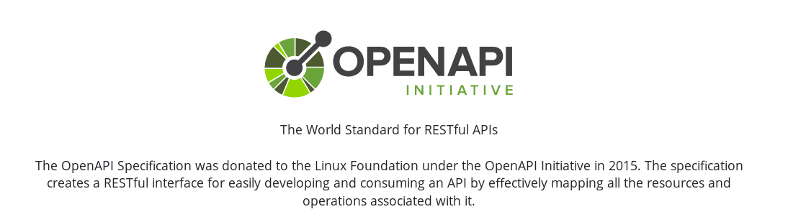

# OpenAPI

REST standardisiert dokumentieren

<small>Ingo Pfennigstorf, Mathias Göbel; 30.04.2019</small>

--

<small>Quelle: https://swagger.io/resources/open-api/</small>

--

## Historie

* 2011, Tony Tam, Bei Wordnik…
> wurde die Notwendigkeit der Automatisierung der API-Dokumentation […] zu
einer Hauptquelle der Frustration.

  * Quelle: Wikipedia
* 2015 an die Linux Foundation übergeben, in OpenAPI ungenannt

---

## [Specs](https://swagger.io/specification/) (JSON-Schema)
## [UI](https://swagger.io/tools/swagger-ui/)

--

## [Editor](https://editor.swagger.io/)

---

## Beispiele

--

### [GDZ-API](https://gdz.sub.uni-goettingen.de/doc/)

--

### [Fontane](https://fontane-nb.dariah.eu/test/openapi/index.html)

---

## Implementierung in Symfony

---

## Code-Generator

### [Django](https://www.django-rest-framework.org/topics/documenting-your-api/#third-party-packages)
### [PHP](https://github.com/zircote/swagger-php) \| [Symfony](https://symfony.com/doc/master/bundles/NelmioApiDocBundle/index.html)
### [JAX-RS](http://www.adam-bien.com/roller/abien/entry/jax_rs_get_swagger_json)
### [RESTXQ](https://ci.de.dariah.eu/exist-repo/)
…mehr als 50 Sprachen und Formate

---

## Code-Generator

> from design to development

Code-Generatoren erstellen auch Server und Clients.

[PHP client library](https://github.com/swagger-api/swagger-codegen#getting-started)
