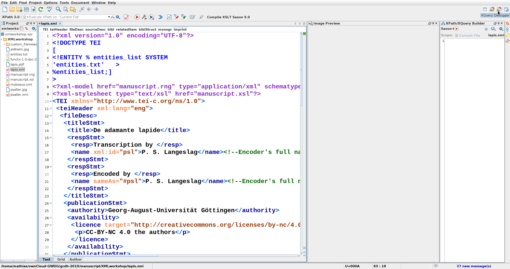
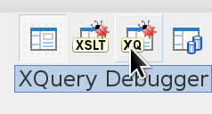
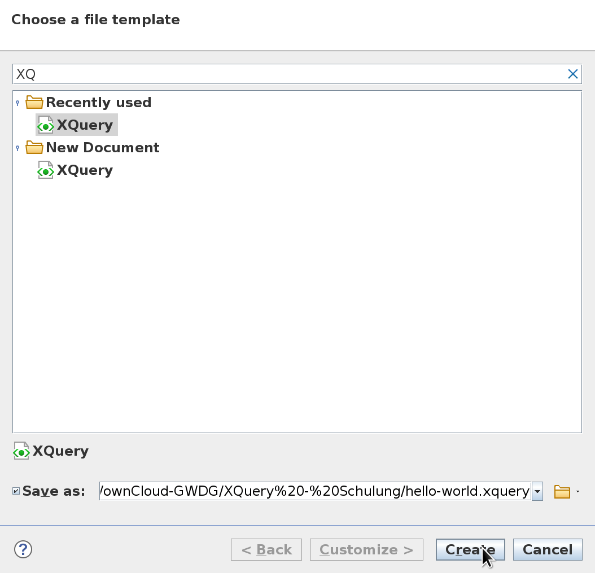
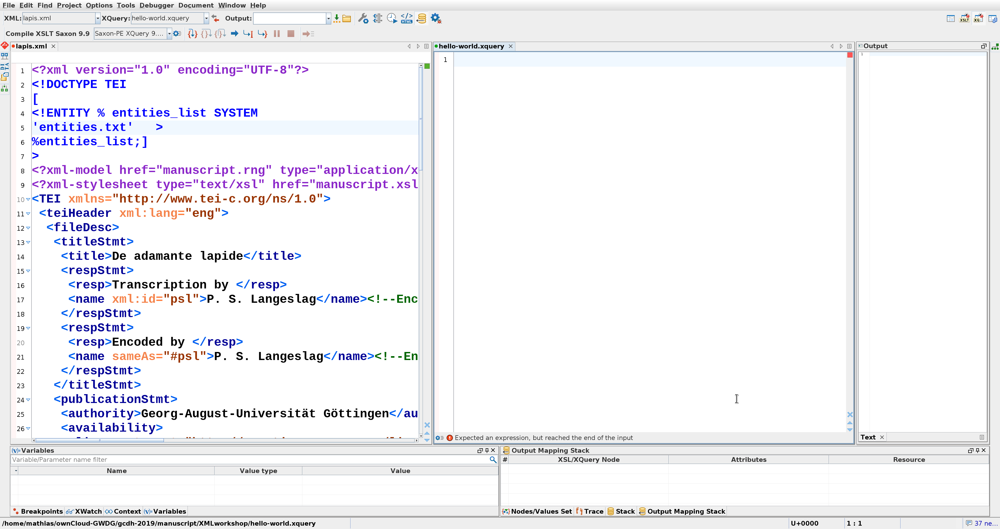
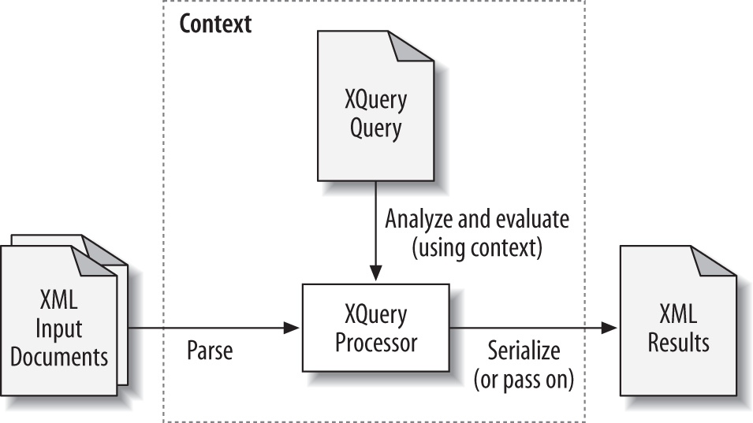

# XQuery

<small>Mathias Göbel, SUB Göttingen, 28.05.2019 @ ADW Göttingen</small>

<small>https://mathias-goebel.github.io/2019-05-XQuery/</small>

--

## Inhalte
+ XML
+ XPath
+ XQuery
+ Anwendung in Oxygen

---

# XML

--

Mit XML, der eXtensible Markup Language, erfassen wir Daten und/oder annotieren
Texte. XML selbst ist aber nur der Überbegriff für eine ganze Familie von
Technologien, die sich rund um das Konzept ansiedeln.

--

Manche davon sind etabliert, werden in der Industrie genutzt. Andere sind schon
`deprecated` - sie werden nicht weiter gepflegt.

Derzeit sind es circa [170 Spezifikationen](https://www.w3.org/TR/?tag=xml).

--

* XML
* XSLT
* XQuery
* XPath
* XSD
* XML Data Model
* SVG
* XPointer
* XInclude
* XSL-FO
* XProc
* XForms (deprecated)
* XHTML
* RelaxNG
* XQueryX
* WSDL
* RESTXQ
* […]

--

Verantwortlich ist das [W3C](https://www.w3.org/standards/xml/).

> XML Technologies including XML, XML Namespaces, XML Schema, XSLT, Efficient XML Interchange (EXI), and other related standards.
<!-- from website linked above -->

--

XML ist strikt hierarchisch organisiert.

--

<!-- .slide: data-background-image="img/Kucuk_Camlica_06465-Wikicommons-Nevit_Dilmen-CC-BY-SA3.jpg" data-background-size="contain" -->
<small style="margin-top: 67%;color:white;">“Tree at Küçük Çamlıca, Istanbul”. Nevit Dilmen from Wikimedia Commons. [CC BY-SA 3.0](http://creativecommons.org/licenses/by-sa/3.0/)</small>

--

XML ist zugänglich für Mensch und Maschine.

--

XML trennt Daten von Präsentation!

--

Damit einher geht eine mögliche Aufgabenverteilung:

Datenerhebung → Programmierung → Design

Input → Processing → Output <!-- .element class="fragment" -->

--

  <!-- .element: height="555" style="filter: brightness(130%) saturate(75%);" -->

Quelle: Institut Obert de Catalunya, CC-BY-NC-SA, [URL](http://ioc.xtec.cat/materials/FP/Materials/2251_ASIX/ASIX_2251_M04/web/html/WebContent/u3/a2/continguts.html)

--

## Anwendungsfälle

+ Präsentationen erzeugen:
  + Publikation (PDF)
  + Überprüfung (HTML)
  + Kollationierung (diff)

--

+ Informationen…
  * …ex­tra­hie­ren
  * …aggregieren
  * …filtern
  * …manipulieren

---

# XPath

Die Grundlage für XQuery ist XPath.

Es gibt *Achsen*, *Funktionen* und *Operatoren*.

--

 <!-- .element: height="555" style="border: 4px solid violet;" -->

<small>Quelle: Crane Softwrights. 2001. In: Kredel, Heinz. Internet-Technologien. 2005. Rechenzentrum Universität Mannheim. [online](http://krum.rz.uni-mannheim.de/inet-2005/sess-302.html).</small>

--

## XPath Achsen: Notation
`ACHSE::NAMESPACE:NAME`

--

## XPath Achsen: Verkettung

`ACHSE::NAMESPACE:NAME/ACHSE::NAMESPACE:NAME`

--

## XPath Achsen: Beispiel 1
```xml
/TEI/teiHeader/fileStmt/titleStmt/title
```

* Dokument
* `/` = "Trennzeichen" (gehe eine Ebene nach unten)
* `TEI` = das erste Element im Dokument = Wurzel = Root
* `/` = s.o.
* `teiHeader` = *alle* Elemente mit dem Namen «teiHeader»
* …

--

## XPath Achsen: Beispiel 2
```xml
//tei:title
descendant::tei:title
```

* Dokument
* `//` = "descendant-or-self" = alle Kinder inkl. des Kontext-Knotens

--

## XPath Achsen: Knotentypen
* `/@name` oder `attribute::`
* `/text()`
* `/comment()`
* `/node()` (Elemente, Attribute, Text)

* `document-node()`
* `processing-instruction()`

--

## XPath Funktionen
```xquery
starts-with(., ""),
contains(., "Bayern"),
tokenize("This is a sentence.", " "),
count(//div)
```

[108 Funktionen](https://www.w3schools.com/xml/xsl_functions.asp) <!-- .element: class="fragment" -->

--

## XPath Operatoren
| Operator | Description | Example |
|-----|-----|-----|
| I (pipe) | Computes two node-sets | `//tei:rs I //tei:name` |
| + | Addition | `6 + 4` |
| - | Subtraction | `6 - 4` |
| * | Multiplication | `6 * 4` |
| div | Division | `8 div 4` |
| = | Equal | `price=9.80` |

Quelle: [w3schools.com](https://www.w3schools.com/xml/xpath_operators.asp)

--

| Operator | Description | Example |
|-----|-----|-----|
| != | Not equal | `price!=9.80` |
| < | Less than | `price<9.80` |
| <= | Less than or equal to | `price<=9.80` |
| > | Greater than | `price>9.80` |
| >= | Greater than or equal to | `price>=9.80` |
| or | or | `price=9.80 or price=9.70` |
| and | and  | `price>9.00 and price<9.90` |
| mod | Modulus (division remainder) | `5 mod 2` |

Quelle: [w3schools.com](https://www.w3schools.com/xml/xpath_operators.asp)

--

## XPath Prädikate

`[]`

* `[1]`
* `[contains(., "test")]`
* `[ancestor::tei:TEI]`

--

### Übung
Zählen Sie bitte alle Element in einem Dokument.

Nutzen Sie dazu bitte die `count()`-Funktion. <!-- .element: class="fragment" -->

--

## XPath Reguläre Ausdrücke

* `tokenize()`: splittet Zeichenketten
* `matches()`: testet Zeichenketten
* `replace()`: Ersetzung

erlauben Reguläre Ausdrücke.

--

Nur ausführbar auf Zeichketten!

_Eingebauter Mechanismus_: Wird keine Zeichenkette gegeben, so werden alle text()-Knoten zusammengefasst.
Sendet man also ein Element (samt untergeordneter Elemente), wird der Text daraus
zusammengefasst als eine Zeichenkette interpretiert.

---

# XQuery

* Programmiersprache
  * Turing-vollständig
  * funktional
  * deklarativ
  * modular
  * nummeriert ab 1
  * interpretierbar

--

> XQuery 1.0 became a W3C Recommendation on January 23, 2007.
>
> XQuery 3.0 became a W3C Recommendation on April 8, 2014.
>
> XQuery 3.1 became a W3C Recommendation on March 21, 2017.

Quelle: https://en.wikipedia.org/w/index.php?title=XQuery&oldid=843799532

--

## XQuery Dateien

* `.xq`
* `.xquery`
* `.xqm`
* `.xql`

--



--



(oben rechts)

--

## Übung 1: Datei anlegen

XQuery-Datei in Oxygen anlegen.

--

Datei → Neu



--



--

…in diese Datei schreiben wir schlicht <span class="fragment">XPath</span>

--

## Kommentare
XML: `<!-- comment -->` (ist als Knoten: comment())

XQuery: `(: comment :)`

--

## Prozessor

Quelle: Priscilla Walmsley: XQuery. O’Reilly Media. 2nd ed., p. 18.

--

## Rechnen

```xq
xquery version "3.1";
1 + 1
```
---

```xq
2
```
<!-- .element: class="fragment" -->

--

Der XQuery Prolog `xquery version "3.1";` wird auf den
folgenden Slides ausgelassen.

--

## Schreiben

```xq
"Hallo Welt."
```
---

```
Hallo Welt.
```
<!-- .element: class="fragment" -->

--

```xq
"eins plus eins ist gleich " || 1+1
```
---
```xq
"eins plus eins ist gleich 2"
```

--

### Lesen
```xq
xquery version "3.1";
declare namespace tei="http://www.tei-c.org/ns/1.0";

//tei:title
```
---
```
<?xml version="1.0" encoding="UTF-8"?>
<title xmlns="http://www.tei-c.org/ns/1.0">De adamante lapide</title>
<title xmlns="http://www.tei-c.org/ns/1.0" level="m">Aldhelmi Opera</title>
<title xmlns="http://www.tei-c.org/ns/1.0" level="s">Monumenta Germaniae Historica</title>
```
<!-- .element: class="fragment" -->

--

### Lesen
```xq
doc("https://en.wikipedia.org")
```
---
```
#document
```
<!-- .element: class="fragment" -->

--

#### TEI einlesen

```
doc("http://www.deutschestextarchiv.de/book/download_xml/puetter_staatsverfassung02_1786")
```

--

### Speichern (let)
```
let $tei :=
  doc("http://www.deutschestextarchiv.de/book/download_xml/puetter_staatsverfassung02_1786")
```

--

### Abrufen (return)
```
return $tei
```

--

### Kombinationen

```
let $tei :=
  doc("http://www.deutschestextarchiv.de/book/download_xml/puetter_staatsverfassung02_1786")

return
  $tei//tei:title
```
<!-- .element: class="fragment" -->

--

### Konstruktion mit `{…}`
```
let $tei :=
  doc("http://www.deutschestextarchiv.de/book/download_xml/puetter_staatsverfassung02_1786")
let $title := $tei//tei:title
return
  <MyNewElement>{ $title }</MyNewElement>
```

--

### Konstruktion mit Statement
```
let $tei :=
  doc("http://www.deutschestextarchiv.de/book/download_xml/puetter_staatsverfassung02_1786")
let $title := $tei//tei:title
return
  element MyNewElement { $title }
```

--

### Iterationen / Schleifen
```xq
for $title in $tei//tei:title
return
  $title
```

„Für jeden Titel, gib aus: den Titel“

--

🌷 for<!-- .element: class="fragment" -->

🌷 let<!-- .element: class="fragment" -->

🌷 where<!-- .element: class="fragment" -->

🌷 order by<!-- .element: class="fragment" -->

🌷 return<!-- .element: class="fragment" -->

### FLWOR <!-- .element: class="fragment" -->

--

## FLWOR
`for` und `let` bedingen ein `return`.
Die Reihenfolge für `where` und `order by` ist vorgegeben.

--

```xq
for $word in $paragraph
order by $w
return
$w
```

--

```xq
for $word in $paragraph
let $WORD := upper-case($word)
order by $WORD
return
$w
```

--

## Struktur

1. Prolog (`xquery`, `declare`)
2. Abfrage (FLWOR)

--

```xquery
xquery version "3.1";
declare namespace tei="http://www.tei-c.org/ns/1.0";

let $hello := "hello"
return
  $hello

```

--

## spezielle Operatoren
`=>` und `!`

--

## =>
Pipe-Operator

```xquery
//* => count()
```

--

## Übung
Wir wollen aus einem Zeitstempel die Uhrzeit auslesen.
Stellen Sie bitte die folgende Abfrage um, so dass zwei `=>`
genutzt werden.
```xquery
substring-before(substring-after("20192504-10:30.00", "-"), ".")

```

--

## !
simple map operator

```xquery
(1,2,3,4) ! . + 1
```

```xquery
for $i in (1,2,3,4)
return $i + 1
```

--

`2,3,4,5`

---

# Übung: Wörter zählen

--

…und als csv ausgeben.

---

# Eigene Funktionen erstellen
`declare function namespace:name() {};`

--

```xquery
xquery version "3.1";
declare namespace myspace="myspace";

declare function myspace:hello() {
  "hello"
};

myspace:hello()
```

---


---

## Lessons Learned

Wenn Ihnen jemand sagt, sie sollten im Projekt stärker auf XML setzen,
so ist das erstmal generell keine schlechte Idee.

Wenn Sie dann noch eine Person haben, die dies unterstützt, die Workflows
entsprechend gestaltet und auf Basis von XML eine Anwendung entwickelt, so haben
Sie diese Person bitte ganz doll lieb.

Und falls Sie diese Person nicht haben: Wir sind auch für Sie da.

---

## Referenzen

[W3C XQuery Specification](https://www.w3.org/TR/xquery-31/)

[FunctX (incl. XPath functions)](http://www.xqueryfunctions.com/)

--

## Lesenswertes

Kay, Michael. 2006. Learn XQuery in 10 Minutes. DataDirect Technologies, Inc. Online: [stylusstudio.com](http://www.stylusstudio.com/whitepapers/Learn_XQuery_10.pdf)

Walmsley, Priscilla. 2016. XQuery, 2nd Edition.  [Chapter 1 for free](http://www.datypic.com/books/xquery/9781491915103_sampler.pdf)

--

## Probierenswertes

* [w3schools.com XQuery Tutorial](https://www.w3schools.com/xml/xquery_intro.asp)
* oder [tutorialspoint.com/xquery](https://www.tutorialspoint.com/xquery/index.htm)
* oder beide <!-- .element: class="fragment" -->

--

## Beispiele

Wikibooks contributors, "XQuery," Wikibooks, The Free Textbook Project,  [online](https://en.wikibooks.org/w/index.php?title=XQuery&oldid=3514402) (accessed February 11, 2019).

---
