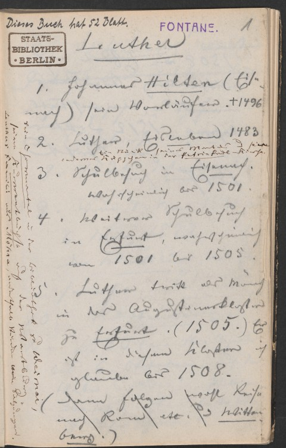
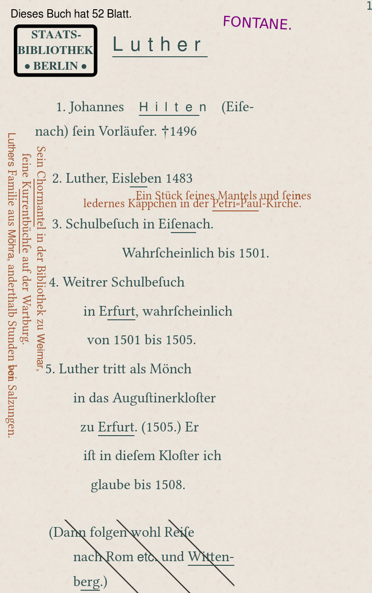
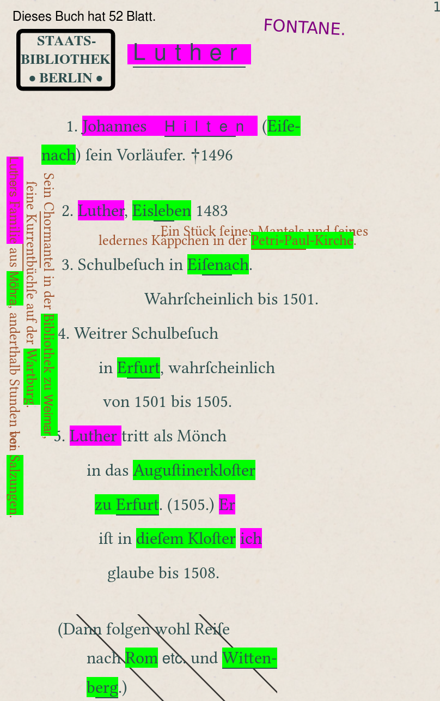

<!-- .slide: data-background-iframe="https://fontane-nb.dariah.eu/tei-conf/net/" -->

# Semantic Networks in Structured Text Data

 CERL Annual Seminar 2019: Collections and Networks

<small>Mathias Göbel, Data Analyst @ Göttingen State and University Library, <a href="https://twitter.com/goebel_m">@goebel_m</a></small>

<small>https://mathias-goebel.github.io/2019-10-net/</small>

^Note: All slides are available online, you can find the URL at the bottom of this slide.
What I am going to present here is based on a talk held and a paper i wrote
together with Martin de la Iglesia back in 2013 where we both worked in a project
on the notebooks of a famous German author from the late 19th century: Theodor Fontane.
“Who is John Maynard?” …

--

## Credits

based on a talk held together with Martin de la Iglesia at TEI Members Meeting
and Conference 2013

prepared with data from the “<a href="https://fontane-nb.dariah.eu">Genetic-critical and annotated edition of Theodor Fontane’s notebooks</a>” and <a href="https://dracor.org">DraCor.org</a>

^Note: A single example i collected form a project on preparing networks based
on dramatic texts, DraCor.org.

--

## ToC
+ Structured Text Data
+ Preparing Networks
+ Reading Networks
+ Outlook

---

## Structured Text Data

--

SUB Göttingen supports projects creating digital editions by

* preparing data model <!-- .element: class="fragment" -->
* designing workflow <!-- .element: class="fragment" -->
* setting up database <!-- .element: class="fragment" -->
* creating search indices <!-- .element: class="fragment" -->
* visualizing the data <!-- .element: class="fragment" -->
* archiving the results <!-- .element: class="fragment" -->

^Note: be aware of that this is not a complete list! one of the most important technology we are utilizing is made by the Text Encoding Initiative. TEI: a guideline for encoding texts.

--

We (use|support|love) TEI.

 <!-- .element: style="max-height:18em" -->

--

TEI is currently based on XML. XML is organized as an hierarchical structure
made of <span class="fragment highlight-red">*nodes*</span>.

^Note: …and a network is a structure made up of a set of nodes (vertices) and a
set of ties between these nodes, called edges (sometimes called links).

--

<iframe height="650" width="650" src="examples/1.html"></iframe>

^Note: In XML doc we always find a root node: the one node to rule them all.
And we can go through these hierarchical structure.

--

<iframe height="650" width="650" src="examples/2.html"></iframe>

^Note: We usually refer to this formation as the “tree-like” structure…

--

<!-- .slide: data-background-image="img/Kucuk_Camlica_06465-Wikicommons-Nevit_Dilmen-CC-BY-SA3.jpg" data-background-size="contain" -->
<small style="margin-top: 67%;color:white;">“Tree at Küçük Çamlıca, Istanbul”. Nevit Dilmen from Wikimedia Commons. [CC BY-SA 3.0](http://creativecommons.org/licenses/by-sa/3.0/)</small>

^Note: nice image.

--

### Example

^Note: So now we want to look at the notebooks and here are the facts:

--

* PI/Editor: Dr. Gabriele Radecke
* funded by the German Research Foundation (DFG) from 2011 to 2019

^Note: …

--

* period: 1859 - 1880s
* 67 notebooks
* 64 - 120 leaves each
* < 10.000 pages

^Note: we are dealing with 10k pages to be found in 67 notebooks.

--

 <!-- .element: style="max-height:15em" -->

<small>[C7, 1r](https://fontane-nb.dariah.eu/test/edition.html?id=%2Fxml%2Fdata%2F16b00.xml&page=1r)</small>

^Note: This is a not randomly chosen page from the notebook with the signature C7.
There are many features to find on this page like stamps, different writing utensil (pencil and pen), different style of characters, underlines, an area marked deleted. We can find place names, persons are mentioned, dates, and much more. And we encoded all of this!

--

 <!-- .element: style="max-height:18em" -->

^Note: Our digital version of this page represents the topographic structure of
the page.

--

```xml
<surface n="1r">
  <zone>
    <line>Luther</line>
    <line>1. Johannes Hilten (Eiſe-</line>
    <!-- … -->
  </zone>
</surface>
```

^Note: Here is an example of the first two lines from the main text of this page.

--

```xml
<surface n="1r">
  <zone>
    <line><seg><rs type="direct" ref="psn:Luther">Luther</rs></seg></line>
    <line>1. <seg><rs type="direct" ref="psn:Hilten">Johannes Hilten</rs></seg> (<seg><rs type="direct" ref="plc:Eisenach">Eiſe-</rs></seg></line>
    <!-- … -->
  </zone>
</surface>
```

--

 <!-- .element: style="max-height:18em" -->

^Note: When we apply this to all entites on this page, we have to encode all
the text highlighted on this screenshot. Focusing on the entities
exclusively, we are about to create a tree-like structure…

---

## Preparing Networks <!-- .element: class="fragment" -->

<iframe height="650" width="650" src="examples/3.html"></iframe>

^Note: To turn this tree into a network, we have to remove the duplicates. In a
network we can have only a single representative for each “observation”.

--

<iframe height="650" width="650" src="examples/4.html"></iframe>

^Note: Instead of applying this method to a single page, we want to scale up to see
the complete notebook.

--

<!-- .slide: data-background-iframe="https://fontane-nb.dariah.eu/tei-conf/rtt/" -->

 <p class="fragment" style="color:red; font-size:4em;">***! TREE !*** <!-- .element: class="fragment fade-out" --></p>

^Note: So we are back at the tree and to prepare a meaningful network, we have
to do two things…

--

1. remove duplicate nodes
1. remove the page level

^Note: Again we have to remove the duplicates. Additionally we have to remove the
page level in the hierarchy to reveal the relation between these nodes. In fact
are not removing the page level, as it is the hierarchical level serves as a kind
of ground truth. All relation between the nodes are based on co-occurrence on a
page.

--

### General Assumption I

> Entities appearing on a single page together have at least this property in common.

--

### General Assumption II

> May be there is a semantic relation between.

---

<!-- .slide: data-background-iframe="https://fontane-nb.dariah.eu/tei-conf/net/" -->

## Reading Networks <!-- .element: class="fragment fade-out" -->

---

## Reading Networks <!-- .element: class="fragment fade-out" -->

<!-- .slide: data-background-iframe="https://fontane-nb.dariah.eu/tei-conf/heb/" -->

--

### Calculations

Size, Density, Centrality, Average Path Length,…

--

### Comparison

--

<!-- .slide: data-background-image="https://lehkost.github.io/slides/2018-vaxjo-drama-studies/images/dlina-corpus-465-cleaned-drama-networks-superposter-900px.jpg" -->

#### Drama Networks Superposter (June 2015)

465 (Cleaned) Graphs Extracted from DLINA Corpus

DOI: 10.6084/m9.figshare.1461761.v1

---

## Outlook

^Note: How do we want to include this into the edition. It is a representation
of the index files. In addition to the lists rendered there, we should include
the networks to give an overview.

--

### Edition

+ of course we need labels aside the nodes <!-- .element: class="fragment" -->
+ and do it more interactive in general <!-- .element: class="fragment" -->
+ include the visualization into the template <!-- .element: class="fragment" -->
+ links and references to the pages/index <!-- .element: class="fragment" -->

--

> The more (encoding) the merrier?

May be not. <!-- .element: class="fragment" -->

--

It is pretty easy to over-engineer a resource.

Text sources needs to be accessible!
