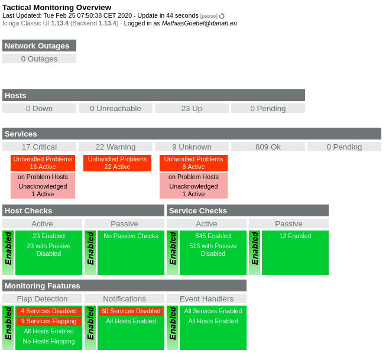

# Whitebox-Monitoring with Prometheus

<small>Mathias Göbel, SUB, Große Entwicklerrunde, 2020-02-25</small>

---

## Monitoring

>  The carrying out of surveillance on, or continuous or regular observation of, an environment or people in order to detect signals, movements or changes of state or quality.

[Wiktionary](https://en.wiktionary.org/w/index.php?title=monitoring&oldid=55027614)

---

### Blackbox

Monitoring a system by its typical behavior: its expected output given a specific
input.

--


<a title="Krauss / CC BY-SA (https://creativecommons.org/licenses/by-sa/4.0)" href="https://commons.wikimedia.org/wiki/File:Blackbox3D-withGraphs.png">Krauss / CC BY-SA via Wikicommons</a>

--

Is a server alive? <!-- .element: class="fragment" -->

Does the response contain a specific word? <!-- .element: class="fragment" -->

--

#### Ping

```sh
> ping 134.76.30.130
PING 134.76.30.130 (134.76.30.130) 56(84) bytes of data.
64 bytes from 134.76.30.130: icmp_seq=1 ttl=61 time=1.05 ms
64 bytes from 134.76.30.130: icmp_seq=2 ttl=61 time=1.08 ms
64 bytes from 134.76.30.130: icmp_seq=3 ttl=61 time=0.904 ms
64 bytes from 134.76.30.130: icmp_seq=4 ttl=61 time=0.908 ms
64 bytes from 134.76.30.130: icmp_seq=5 ttl=61 time=1.11 ms
64 bytes from 134.76.30.130: icmp_seq=6 ttl=61 time=0.976 ms
64 bytes from 134.76.30.130: icmp_seq=7 ttl=61 time=1.03 ms
64 bytes from 134.76.30.130: icmp_seq=8 ttl=61 time=1.17 ms
^C
--- 134.76.30.130 ping statistics ---
8 packets transmitted, 8 received, 0% packet loss, time 7008ms
rtt min/avg/max/mdev = 0.904/1.026/1.168/0.087 ms
```

--

#### HTTP Method: Head

```sh
> curl sub.uni-goettingen.de --head                                                                                                                            07:41:32
HTTP/1.1 301 Moved Permanently
Date: Tue, 25 Feb 2020 06:42:07 GMT
Server: Apache/2.4.7 (Ubuntu)
Location: https://sub.uni-goettingen.de/
Cache-Control: max-age=0
Expires: Tue, 25 Feb 2020 06:42:07 GMT
Content-Type: text/html; charset=iso-8859-1
```

--

```sh
> curl https://sub.uni-goettingen.de --head
HTTP/1.1 307 Temporary Redirect
Date: Tue, 25 Feb 2020 06:43:27 GMT
Server: Apache/2.4.7 (Ubuntu)
X-Powered-By: PHP/5.5.9-1ubuntu4.29
Location: https://sub.uni-goettingen.de/sub-aktuell/
Content-Type: text/html
```

--

```sh
> curl https://sub.uni-goettingen.de/sub-aktuell/ --head
HTTP/1.1 200 OK
Date: Tue, 25 Feb 2020 06:44:05 GMT
Server: Apache/2.4.7 (Ubuntu)
X-Powered-By: PHP/5.5.9-1ubuntu4.29
Cache-Control: private
Content-Length: 43251
Vary: Accept-Encoding
Content-Type: text/html; charset=utf-8
```

--

**OK**

--



https://icinga.de.dariah.eu/cgi-bin/icinga/status.cgi?host=fontane-nb.dariah.eu

--

There is also a [Grafana Dashboard](https://metrics.gwdg.de/d/000000102/generic-dariah-stats?orgId=6)
for server-internal properties…

--

…but we are still not inside of the application:

How many amount of disk space is used for a single application?
How often a single applications writes stack traces somewhere?

---

### White box

[System](https://en.wikipedia.org/wiki/White_box_(software_engineering))
* internals can be viewed, but usually not altered

[Testing](https://en.wikipedia.org/wiki/White-box_testing)
* tests internal structures or workings of an application

--

Requires deep knowledge of the system.

---

## Prometheus

https://prometheus.io/

--

### Features

* a multi-dimensional data model with time series data identified by metric name and key/value pairs
* PromQL, a flexible query language to leverage this dimensionality
* no reliance on distributed storage; single server nodes are autonomous

Source: https://prometheus.io/docs/introduction/overview/

--

### Components

* the main Prometheus server which scrapes and stores time series data
* client libraries for instrumenting application code
* special-purpose exporters for services like HAProxy, StatsD, Graphite, etc.

Source: https://prometheus.io/docs/introduction/overview/

--

### Exporter

Exporter are software that lives in or next to your application. Its purpose is
to collect and publish metrics frequently.

---

#### [JMX](http://141.5.101.79:8079/metrics)

```
# HELP jvm_memory_bytes_used Used bytes of a given JVM memory area.
# TYPE jvm_memory_bytes_used gauge
jvm_memory_bytes_used{area="heap",} 2.555589648E9
jvm_memory_bytes_used{area="nonheap",} 2.02110512E8
```

--

<!-- .slide: data-background-iframe="http://141.5.101.79:8079/metrics" -->

--

Easy to include:
```
-javaagent:jmx_prometheus_javaagent-0.12.0.jar=8079:jmx_prometheus_config.yaml
```

--

#### [Telegraf](http://141.5.101.79:8079/metrics)

```
# HELP system_n_cpus Telegraf collected metric
# TYPE system_n_cpus gauge
system_n_cpus{host="fontane-nb.dariah.eu"} 4
```

--

* *Exporters* recreate statistics every X seconds.
* Picked up by Prometheus server every X seconds. (You are responsible to sync
  the amount of time!)

--

## GitLab Integration

[Documentation](https://docs.gitlab.com/ee/user/project/integrations/prometheus.html#prometheus-integration)

---

GitLab can log (and partly control) your deployments with so called *Environments*.
Prometheus integration is part of this larger tool set.

--

<!-- .slide: data-background-iframe="https://gitlab.gwdg.de/fontane-notizbuecher/build/-/environments/136/metrics" -->

--

Organized with *Dashboards*.

Custom dashboard descriptions are part of the git repo. [Here] you can find a
short example.

--

```yaml
dashboard: 'Fontane Notizbücher'
panel_groups:
  - group: 'eXist-db'
    panels:
      - title: "Heap Used"
        type: area-chart
        y_label: "Memory"
        metrics:
          - id: heap_used
            query_range: 'java_lang_Memory_HeapMemoryUsage_used{job="%{ci_environment_slug}"}/1024^3'
            label: "HeapMemoryUsage_used"
            unit: "count"
```

--

[Example](https://gitlab.gwdg.de/fontane-notizbuecher/build/-/environments/136/metrics?dashboard=.gitlab%2Fdashboards%2Fstandard.yml)

--

Well, ☹.

--

### Alerting

Useful for managed Prometheus installations (K8s). Otherwise it simply adds
the alert rule to the graph (showing a red zone).

---

## Testengine

Where does the data shown above comes from? We have a instance of Prometheus
ready for your metrics.

http://141.5.107.191:9090/

--

### Configuration

[git repo](https://gitlab.gwdg.de/subugoe/prometheus-conf)

---

A brief overview (in german):

https://intranet.sub.uni-goettingen.de/x/4XXCBg
