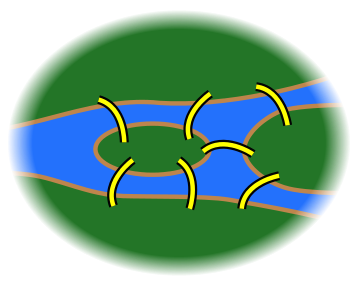

<!-- .slide: data-background-image="../2018-05-Netzwerkanalyse/img/the_internet_map_2015-extract.png" class="title" -->

# Dramennetzwerke

Seminar: Digitale Dramenanalyse

<small>Mathias Göbel, SUB Göttingen, 18.1.2021</small>

<small>Slides: mathias-goebel.github.io/2021-01-Dramennetzwerke/index.html</small>

|||

## Agenda

- Netzwerke
  - Historie
  - Definitionen
- Small Worlds
- DraCor

---

## Netzwerke

|||

|||

### Historie

Leonhard Eulers (1707-1783) Lösung des Königsberger Brückenproblems (1735)

> Ist es mögliche einen Weg zu finden, der jede Brücke genau einmal überquert und zum Ausgangspunkt zurück führt?

|||

<small>Quelle: Wikisource</small>

|||

<small>Quelle: Wikisource</small>

|||

<small>Quelle: Wikisource</small>

|||

- keine Berücksichtigung der Positionen von Brücken und Landmassen
- einzig die Anzahl der Brücken und deren Start- und Endpunkte sind entscheidend

Es entstand ein ungewichteter und ungerichteter Graph.

|||

### Terminologie

||| 

### Netzwerk

*network, graph*

>  a network can be defined as a graph in which nodes and/or edges have attributes (e.g. names)

[Wikipedia](https://en.wikipedia.org/wiki/Network_theory)

|||

#### Knoten

*nodes, vertices, links*

|||

##### Eigenschaften

- gewichtet
- gruppiert
- benannt

|||

#### Kanten (edges, links, relations)

|||

##### Eigenschaften

  - gerichtet (*directed*) oder
  - ungerichtet (*undirected, bidirectional*)
  - gewichtet (*weighted*)

|||

#### Verbundenheit

*connectedness*

distinkte Gruppen (nicht streng verbundenes Netzwerk)

|||

 <!-- .element style="max-height: 400px;" -->

“Outsider” (einzelne Knoten, nicht mit dem Netzwerk verbunden)

|||

### Kennzahlen

|||

#### Größe

*size*

Anzahl der Knoten

|||

|||

#### Degree
  - per node
  - maximum
  - average

|||

|||

#### Dichte

*density*

Anzahl der Kanten im Verhältnis zur Anzahl möglicher Kanten.

N × (N-1) × ½

|||

|||

#### Weg, Pfad

*path*

|||

|||

#### Average Path Length

> the average number of steps along the shortest paths for all possible pairs of network nodes.

[Wikipedia](https://en.wikipedia.org/wiki/Average_path_length)

|||

#### Centrality
##### closeness

> the average length of the shortest path between the node and all other nodes in the graph. Thus the more central a node is, the closer it is to all other nodes.

[Wikipedia](https://en.wikipedia.org/wiki/Centrality)

|||

##### betweenes

> the number of times a node acts as a bridge along the shortest path between two other nodes.

[Wikipedia](https://en.wikipedia.org/wiki/Centrality#Betweenness_centrality)

---

## Dramen als ‘Small Worlds’

(basierend auf [DH2016](https://dh2016.adho.org/abstracts/360))

|||

### Konzept

> "widespread in biological, social and man-made systems"

(Watts & Strogatz 1998, 442)

> "highly clustered, like regular lattices, yet have small characteristic path lengths, like random graphs"

(Watts & Strogatz 1998, 440)

|||

### Operationalisierung

|||

#### Average Path Length APL

Die Average Path Length (des betrachteten Netzwerks) unterscheidet sich nicht signifikant von zufälligen Netzwerken.

|||

#### Power Law

Verteilung des “Degree” folgt dem Potzengesetz (*power law*).
Es wird erwartet, dass viele Knoten eine geringe Anzahl an Kanten haben, einige wenige aber sehr viele Kanten.

|||

#### Clusterkoeffizient (C)

Clusterkoeffizient (des betrachteten Netzwerks) ist signifikant höher, verglichen mit zufällig erstellten Netzwerk gleicher Größe und gleicher Kantenanzahl.

|||

Anwendung in unserem Fall auf ein diverses und größeres Korpus: 465 deutschsprachige Dramen.

|||

### Vorgehen C

- 1000 Zufallsnetzwerke gleicher Größe und gleicher Kantenanzahl
- Berechnung des Mittelwertes für C der Zufallsnetzwerke
- Standardabweichung (SD, statistisches Maß, „Streubreite“)

- signifikant größer:
  - Mittelwert + 2 × SD

|||

|||

### Vorgehen APL

- 1000 Zufallsnetzwerke gleicher Größe und gleicher Kantenanzahl
- Berechnung der Durchschnittswerte für die Zufallsnetzwerke
- Standardabweichung (SD, statistisches Maß, „Streubreite“)

- kein signifikanter Unterschied:
  - innerhalb Mittelwert ± 2 × SD

|||

|||

### Vorgehen *Power Law*

- Degree-Verteilung pro Drama berechnen
- Regressionsanalysen (linear, qudartisch, exponentiell, logaritmisch, Potenz)
  - R² = „Genauigkeit“ der Funktionstypen

- R² mit kleinstem Wert für Potenzfunktion

|||

|||

|||

### Ergebnis

<table>
    <tbody>
        <tr> <th><b>Title</b></th> <th><b>Author</b></th> <th><b>Year</b></th></tr>
        <tr> <td>Götz</td> <td>Goethe</td> <td>1773</td></tr>
        <tr> <td>Doktor Faust</td> <td>Soden</td> <td>1797</td></tr>
        <tr> <td>Jerusalem</td> <td>Arnim</td> <td>1811</td></tr>
        <tr> <td>Der Barometermacher</td> <td>Raimund</td> <td>1823</td></tr>
        <tr> <td>Der böse Geist</td> <td>Nestroy</td> <td>1833</td></tr>
    </tbody>
</table>

|||

### Diskussion

Es wurde ein Netzwerkstruktur gezeigt, die sich von anderen abgrenzt.
Es gibt keine Aussage dazu, wie stark diese Abgrenzung ist. 

|||

#### Falls es sie gibt: Was ist die Norm?

|||

|||

|||

#### Gibt es weitere spezifizierbare Typen?

|||

<table>
    <tbody>
        <tr>
            <td style="font-size:0.6em;text-align:left;">Goethe, "Götz" <b>Drama of the "great individual"</b> </td>
            <td style="font-size:0.6em;text-align:right;">Mühsam, "Judas" <b>Drama of the crowds</b></td>
        </tr>
        <tr>
            <td>

</td>
            <td>

</td>
        </tr>
        <tr>
            <td style="font-size:0.7em;text-align:left;"><b>Aristocratic model?</b></td>
            <td style="font-size:0.7em;text-align:right;"><b>Communist model?</b></td>
        </tr>
    </tbody>
</table>

---

## DraCor

[https://dracor.org](https://dracor.org)

Forschungsinfrastruktur zur Arbeit mit digitalen Dramentexten.